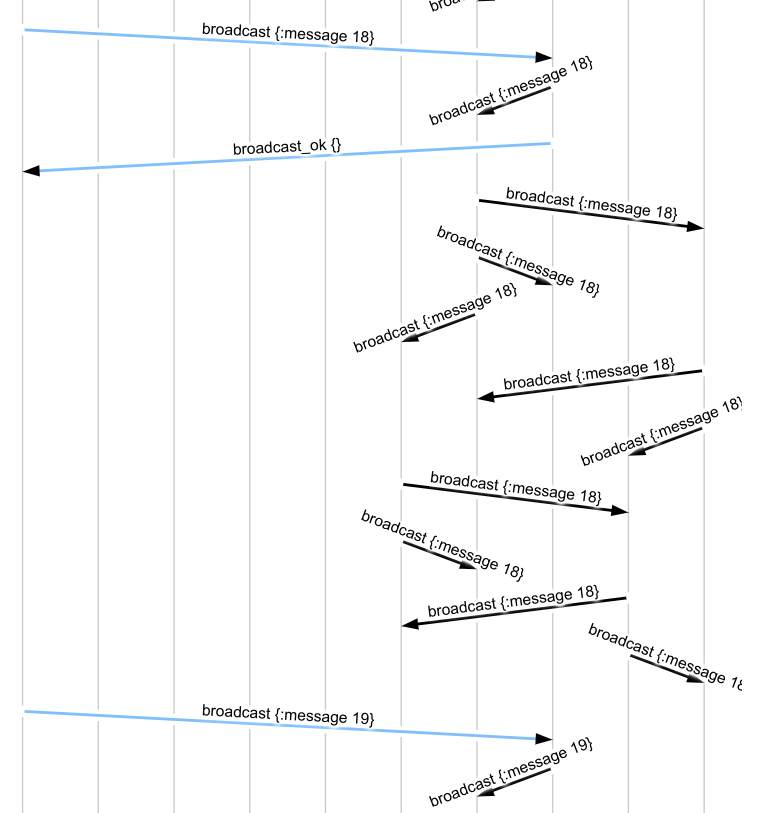

# Gossip-Based Broadcast

A *broadcast* system allows one to share a message with all nodes in the
cluster. In Maelstrom, the [broadcast
workload](https://github.com/jepsen-io/maelstrom/blob/main/doc/workloads.md#workload-broadcast)
lets you practice building broadcast system with a simple API:

- A `topology` message informs the node of an (optional) network topology: a
  map of nodes to neighbors.
- A `broadcast` request sends a message into the network.
- A `read` request reads all the messages present on a single node.

Maelstrom checks broadcast systems by verifying that every broadcast message is
(eventually) present on every node, and can tell you how long it takes for that
to happen--as well as how many messages were required.

In this chapter, we'll build a variety of gossip-based broadcast systems, build
up a reusable abstraction for network servers, and see how network faults and
different strategies for retries affect message delivery.

## A Basic Node Abstraction

In the [previous chapter](/doc/02-echo/index.md) we built a simple echo server
from scratch. Many of those concepts: reading messages from STDIN, printing
them to STDOUT, logging to STDERR, handling initialization, assigning message
IDs, etc. are so universal that nearly *every* server we write is going to need
them. Let's see if we can pull some of those things apart, so our servers can
focus on logical state and message flow.

We'll create a new file called `node.rb`, and create a Node class in it. We
know our node will need to keep track of its own node id, and those of the
other nodes in the cluster, as well as allocating message IDs:

```rb
require 'json'

class Node
  attr_reader :node_id, :node_ids

  def initialize
    @node_id = nil
    @node_ids = nil
    @next_msg_id = 0
  end
end
```

As our programs get more sophisticated, they'll need to operate concurrently.
We could write this as a single-threaded event loop, using fibers or
coroutines, or via threads, but for our purposes, threads will simplify a good
deal. Multithreaded access means we need a lock--preferably re-entrant--to
protect our IO operations, assigning messages, and so on. We'll want one for
logging to STDERR too, so that our log messages don't get mixed up.

```rb
  def initialize
    ...
    @lock = Monitor.new
    @log_lock = Mutex.new
  end
```

Logging first. We're going to want a reliable way to write messages to STDERR,
and make sure they don't interleave. This will help us figure out what's going
on inside our servers:

```rb
  # Writes a message to stderr
  def log(message)
    @log_lock.synchronize do
      STDERR.puts message
      STDERR.flush
    end
  end
```

Next, let's take the `reply!` method we wrote for sending messages, and turn it
into a pair of methods: one for replying, and one for sending an arbitrary
message.

```rb
  # Send a body to the given node id. Fills in src with our own node_id.
  def send!(dest, body)
    msg = {dest: dest,
           src: @node_id,
           body: body}
    @lock.synchronize do
      log "Sent #{msg.inspect}"
      JSON.dump msg, STDOUT
      STDOUT << "\n"
      STDOUT.flush
    end
  end

  # Reply to a request with a response body
  def reply!(req, body)
    body = body.merge({in_reply_to: req[:body][:msg_id]})
    send! req[:src], body
  end
```

Note our use of `merge` to make changes to hashmaps here: we're trying to be
careful about not mutating our arguments in-place. Merge returns a new map with
changes.

Now, what about receiving messages? We'll need to parse our messages as JSON.
For convenience, we'll transform the message and body keys to use `:keywords`,
rather than `"strings"`, as their keys.

```rb
  # Turns a line of STDIN into a message hash
  def parse_msg(line)
    msg = JSON.parse line
    msg.transform_keys!(&:to_sym)
    msg[:body].transform_keys!(&:to_sym)
    msg
  end
```

Finally, a simple mainloop, adapted from our echo server:

```rb
  # Loops, processing messages from STDIN
  def main!
    while line = STDIN.gets
      msg = parse_msg line
      log "Received #{msg.inspect}"

      @lock.synchronize do
        # Now what?
      end
    end
  end
```

What *should* we do with each message? It's going to depend on the kind of node
we're building. Ideally, we'd like to be able to write something like:

```rb
node.on "broadcast" do |msg|
  # Handle this broadcast message...
end
```

... and have that block called with any message which has `type: "broadcast"`.
To facilitate this, we'll store a map of message types to closures, and define an `on` method which updates that map.

```rb
  def initialize
    ...
    @handlers = {}
  end

  # Register a new message type handler
  def on(type, &handler)
    if @handlers[type]
      raise "Already have a handler for #{type}!"
    end

    @handlers[type] = handler
  end
```

Now our mainloop can look up the appropriate handler for each incoming message,
and call it.

```rb
  def main!
    Thread.abort_on_exception = true

    while line = STDIN.gets
      msg = parse_msg line
      log "Received #{msg.inspect}"

      handler = nil
      @lock.synchronize do
        if handler = @handlers[msg[:body][:type]]
          # Good!
        else
          raise "No handler for #{msg.inspect}"
        end
      end

      begin
        handler.call msg
      rescue => e
        log "Exception handling #{msg}:\n#{e.full_message}"
      end
    end
  end
```

Now our nodes can handle their own initialization. When we create a Node
instance, we'll have it register a handler for the `init` message:

```rb
  def initialize
    @node_id = nil
    @node_ids = nil
    @next_msg_id = 0

    @handlers = {}

    @lock = Monitor.new
    @log_lock = Mutex.new

    # Register an initial handler for the init message
    on "init" do |msg|
      # Set our node ID and IDs
      @node_id = msg[:body][:node_id]
      @node_ids = msg[:body][:node_ids]

      reply! msg, type: "init_ok"
      log "Node #{@node_id} initialized"
    end
  end
```

All right! Let's try it out! We'll create a new file for our broadcast server,
called `broadcast.rb`. That file will require our `node.rb` code, and create a
Broadcast class which wraps a Node.

```rb
#!/usr/bin/env ruby

require_relative 'node.rb'

class Broadcast
  attr_reader :node
  def initialize
    @node = Node.new
  end
end

Broadcast.new.node.main!
```

Let's start our node, and see if it responds to an `init` message appropriately:

```
$ chmod +x broadcast.rb
$ ./maelstrom test -w broadcast --bin broadcast.rb --time-limit 5 --log-stderr
...
INFO [2021-02-23 09:35:26,128] jepsen node n1 - maelstrom.db Setting up n1
INFO [2021-02-23 09:35:26,129] jepsen node n1 - maelstrom.process launching broadcast.rb nil
INFO [2021-02-23 09:35:26,228] n1 stderr - maelstrom.process Received {:dest=>"n1", :body=>{:type=>"init", :node_id=>"n1", :node_ids=>["n1"], :msg_id=>1}, :src=>"c0", :id=>0}
INFO [2021-02-23 09:35:26,229] n1 stderr - maelstrom.process Sent {:dest=>"c0", :src=>"n1", :body=>{:type=>"init_ok", :in_reply_to=>1}}
INFO [2021-02-23 09:35:26,230] n1 stderr - maelstrom.process Node n1 initialized
...
```

Very good! The test goes on to crash, but as distributed systems engineers,
we're used to that. Let's see what went wrong:

```
clojure.lang.ExceptionInfo: Node n1 crashed with exit status 1. Before crashing, it wrote to STDOUT:

{"dest":"c0","src":"n1","body":{"type":"init_ok","in_reply_to":1}}

And to STDERR:

Received {:dest=>"n1", :body=>{:type=>"init", :node_id=>"n1", :node_ids=>["n1"], :msg_id=>1}, :src=>"c0", :id=>0}
Sent {:dest=>"c0", :src=>"n1", :body=>{:type=>"init_ok", :in_reply_to=>1}}
Node n1 initialized
Received {:dest=>"n1", :body=>{:type=>"topology", :topology=>{"n1"=>[]}, :msg_id=>1}, :src=>"c1", :id=>2}
/home/aphyr/maelstrom/node.rb:85:in `block in main!': No handler for {:dest=>"n1", :body=>{:type=>"topology", :topology=>{"n1"=>[]}, :msg_id=>1}, :src=>"c1", :id=>2} (RuntimeError)
	from /home/aphyr/maelstrom/node.rb:81:in `synchronize'
	from /home/aphyr/maelstrom/node.rb:81:in `main!'
	from /home/aphyr/maelstrom/broadcast.rb:12:in `<main>'
```

Aha! We've received a `type: "topology"` message. Let's figure out what to do
with THAT.

## Topology

The [Broadcast workload docs](/doc/workloads.md#workload-broadcast) say that a
`topology` message is sent at the start of the test, and provides each node
with a map of node IDS to neighbors. We're not required to use this
information--we could compute our own neighbors--but it'll be nice to have
later. We'll add an `@neighbors` field to our Broadcast server, and initialize
it when a topology message arrives.

```rb
  def initialize
    @node = Node.new
    @neighbors = []

    @node.on "topology" do |msg|
      @neighbors = msg[:body][:topology][@node.node_id]
      @node.log "My neighbors are #{@neighbors.inspect}"
      @node.reply! msg, type: "topology_ok"
    end
  end
```

Let's give that a shot.

```
$ ./maelstrom test -w broadcast --bin broadcast.rb --time-limit 5 --log-stderr
...
INFO [2021-02-23 10:08:50,936] n3 stderr - maelstrom.process My neighbors are ["n2"]
INFO [2021-02-23 10:08:50,936] n5 stderr - maelstrom.process My neighbors are ["n2", "n4"]
INFO [2021-02-23 10:08:50,936] n4 stderr - maelstrom.process My neighbors are ["n1", "n5"]
INFO [2021-02-23 10:08:50,936] n1 stderr - maelstrom.process My neighbors are ["n4", "n2"]
INFO [2021-02-23 10:08:50,936] n2 stderr - maelstrom.process My neighbors are ["n5", "n3", "n1"]
...
```

Now we can see each node receiving a set of neighbors. The default topology
arranges all nodes in a two-dimensional grid, like so:

```
n1--n2--n3
 |  |
n4--n5
```

Next, we'll need to do the actual work of the broadcast system: accepting new
messages, and letting Maelstrom read them.

## Broadcast and Read

The [Broadcast workload docs](/doc/workloads.md#workload-broadcast) docs say
that we'll receive `broadcast` messages with a `:message` field containing an
arbitrary payload, and `read` messages which should return the set of all
messages present on a node. Let's add a message set, and a lock to control
access, to our Broadcast class:

```rb
...
require 'set'
...
  def initialize
    @node = Node.new
    @neighbors = []
    @lock = Mutex.new
    @messages = Set.new
    ...
  end
```

Next, we want to let Maelstrom *read* the message set. We'll add another
handler to the `initialize` method for `read` messages.

```rb
    @node.on "read" do |msg|
      @lock.synchronize do
        @node.reply! msg, type: "read_ok", messages: @messages.to_a
      end
    end
  end
```

And whenever we receive a `broadcast` message, we'll add that message's message
(oh no) to the set:

```rb
    @node.on "broadcast" do |msg|
      m = msg[:body][:message]
      @lock.synchronize do
        @messages.add m
      end
      @node.reply! msg, type: "broadcast_ok"
    end
```

Let's try that out! We'll dial up the request rate to see how nodes change over time:

```
$ ./maelstrom test -w broadcast --bin broadcast.rb --time-limit 5 --rate 10
...
INFO [2021-02-23 10:30:56,288] jepsen worker 0 - jepsen.util 0	:invoke	:broadcast	0
INFO [2021-02-23 10:30:56,290] jepsen worker 0 - jepsen.util 0	:ok	:broadcast	0
```

Here, worker 0 has made a request to the first node (`n1`), asking it to
broadcast the message `0`. That node replied with `broadcast_ok`, so Maelstrom
recorded the broadcast operation as `:ok`.

```
INFO [2021-02-23 10:30:56,514] jepsen worker 0 - jepsen.util 0	:invoke	:read	nil
INFO [2021-02-23 10:30:56,516] jepsen worker 0 - jepsen.util 0	:ok	:read	[0]
```

A subsequent `read` request returned `read_ok`, and included the set of
messages received so far: `[0]`. As time goes on, more broadcast messages are
added to the set on node `n1`.

```
...
INFO [2021-02-23 10:30:59,036] jepsen worker 0 - jepsen.util 0	:invoke	:broadcast	9
INFO [2021-02-23 10:30:59,038] jepsen worker 0 - jepsen.util 0	:ok	:broadcast	9
INFO [2021-02-23 10:30:59,204] jepsen worker 0 - jepsen.util 0	:invoke	:broadcast	10
INFO [2021-02-23 10:30:59,205] jepsen worker 0 - jepsen.util 0	:ok	:broadcast	10
INFO [2021-02-23 10:30:59,322] jepsen worker 0 - jepsen.util 0	:invoke	:broadcast	11
INFO [2021-02-23 10:30:59,323] jepsen worker 0 - jepsen.util 0	:ok	:broadcast	11
...
INFO [2021-02-23 10:30:59,656] jepsen worker 0 - jepsen.util 0	:invoke	:read	nil
INFO [2021-02-23 10:30:59,658] jepsen worker 0 - jepsen.util 0	:ok	:read	[0 9 10 11]
```

At the end of the test, Maelstrom waits a bit for all nodes to converge, then
asks each node for their final set of messages:

```
INFO [2021-02-23 10:31:01,240] jepsen worker 2 - jepsen.generator.interpreter Waiting for recovery...
INFO [2021-02-23 10:31:11,242] jepsen worker 2 - jepsen.util 2	:invoke	:read	nil
INFO [2021-02-23 10:31:11,243] jepsen worker 3 - jepsen.util 3	:invoke	:read	nil
INFO [2021-02-23 10:31:11,243] jepsen worker 0 - jepsen.util 0	:invoke	:read	nil
INFO [2021-02-23 10:31:11,243] jepsen worker 1 - jepsen.util 1	:invoke	:read	nil
INFO [2021-02-23 10:31:11,243] jepsen worker 4 - jepsen.util 4	:invoke	:read	nil
INFO [2021-02-23 10:31:11,244] jepsen worker 3 - jepsen.util 3	:ok	:read	[1 3 6 12]
INFO [2021-02-23 10:31:11,244] jepsen worker 2 - jepsen.util 2	:ok	:read	[4 16 20]
INFO [2021-02-23 10:31:11,244] jepsen worker 0 - jepsen.util 0	:ok	:read	[0 9 10 11 15 18]
INFO [2021-02-23 10:31:11,244] jepsen worker 1 - jepsen.util 1	:ok	:read	[2 5 7 13 14 17 19]
INFO [2021-02-23 10:31:11,244] jepsen worker 4 - jepsen.util 4	:ok	:read	[8]
```

All the broadcast messages are present--but the test fails:

```
            :attempt-count 21,
            :stable-count 1,
            :stale-count 1,
            :stale (8),
            ...
            :lost-count 20,
            :lost (0 1 2 3 4 5 6 7 9 10 11 12 13 14 15 16 17 18 19 20),
```

Out of 21 attempted broadcast messages, only one was *stable*: present durably
in all reads after some time *t*. One message was *stale*, meaning that it took
some time to appear in all reads, rather than being visible immediately. That
stale, stale message was number 8--which just so happens to correspond to the
only value in the very last read Maelstrom completed: worker 4 saw the set of
messages as just `[8]`. All other messages were considered *lost*.

Why are these messages lost? We saw 0, 1, 2, and so on in the final reads--but
they weren't present *across all nodes*, and that's what the broadcast problem
is all about. Our nodes haven't done any *communication*. Indeed, if we look at
`store/latest/messages.svg`, we can see that each our server nodes haven't
exchanged any information.


We need to actually *share state* for this to work. Let's do that next.

## Tell Your Friends, Tell Your Neighbors

It's time to use that topology information we got from Maelstrom. When we get a
new broadcast message, we'll send our *own* broadcast message to all our
neighbors. For each of our neighbors, we'll send them a broadcast. We won't
bother with acknowledgements here: this is a straightforward fire-and-forget
kind of message. We'll look for the presence of a `msg_id` field in broadcast
messages to tell whether to reply or not.

```rb
    @node.on "broadcast" do |msg|
      m = msg[:body][:message]
      @lock.synchronize do
        @messages.add m
      end

      # Gossip this message to neighbors
      @neighbors.each do |neighbor|
        @node.send! neighbor, type: "broadcast", message: m
      end

      # Inter-server messages don't have a msg_id, and don't need a response
      if msg[:body][:msg_id]
        @node.reply! msg, type: "broadcast_ok"
      end
    end
```

Let's see what happens!

```
$ ./maelstrom test -w broadcast --bin broadcast.rb --time-limit 5 --rate 10
...
NFO [2021-02-23 11:21:52,923] jepsen worker 2 - jepsen.util 2	:invoke	:broadcast	0
INFO [2021-02-23 11:21:53,057] jepsen worker 3 - jepsen.util 3	:invoke	:broadcast	1
INFO [2021-02-23 11:21:53,128] jepsen worker 4 - jepsen.util 4	:invoke	:broadcast	2
INFO [2021-02-23 11:21:53,309] jepsen worker 0 - jepsen.util 0	:invoke	:broadcast	3
INFO [2021-02-23 11:21:53,446] jepsen worker 1 - jepsen.util 1	:invoke	:read	nil
INFO [2021-02-23 11:21:54,686] jepsen worker 1 - jepsen.util 1	:ok	:read	[0 1 2]
INFO [2021-02-23 11:21:54,686] jepsen worker 1 - jepsen.util 1	:invoke	:read	nil
INFO [2021-02-23 11:21:57,929] jepsen worker 2 - jepsen.util 2	:info	:broadcast	0	:net-timeout
INFO [2021-02-23 11:21:58,057] jepsen worker 3 - jepsen.util 3	:info	:broadcast	1	:net-timeout
INFO [2021-02-23 11:21:58,128] jepsen worker 4 - jepsen.util 4	:info	:broadcast	2	:net-timeout
INFO [2021-02-23 11:21:58,309] jepsen worker 0 - jepsen.util 0	:info	:broadcast	3	:net-timeout
INFO [2021-02-23 11:21:58,992] jepsen worker 1 - jepsen.util 1	:ok	:read	[0 1 2 3]
```

That's not great! Some requests go through OK, but we're seeing an awful lot of
timeouts. Let's take a look at Maelstrom's network statistics, printed at the
end of the test (and in `results.edn`):

```edn
 :net {:stats {:all {:send-count 894469,
                     :recv-count 450941,
                     :msg-count 894469,
                     :msgs-per-op 81315.37},
               :clients {:send-count 34,
                         :recv-count 30,
                         :msg-count 34},
               :servers {:send-count 894435,
                         :recv-count 450911,
                         :msg-count 894435,
                         :msgs-per-op 81312.27}},
```

This tells us that there were 894469 unique messages sent in the course of this
test--almost 81,000 per logical operation. Almost all of that was inter-server
traffic. Let's take a look at `messages.svg` to see what's going on:


Aha! We've constructed an *infinite loop*: when one server receives a message,
it tells its neighbors, who promptly turn around and tell *their* neighbors,
and the message ricochets around the network forever, amplified by a factor of
`neighbors.count` at each step. We should avoid broadcasting a message if we
already have it.

```rb
    @node.on "broadcast" do |msg|
      m = msg[:body][:message]
      @lock.synchronize do
        unless @messages.include? m
          @messages.add m

          # Gossip this message to neighbors
          @neighbors.each do |neighbor|
            @node.send! neighbor, type: "broadcast", message: m
          end
        end
      end

      # Inter-server messages don't have a msg_id, and don't need a response
      if msg[:body][:msg_id]
        @node.reply! msg, type: "broadcast_ok"
      end
    end
```

Let's see what happens:

```
$ ./maelstrom test -w broadcast --bin broadcast.rb --time-limit 5 --rate 10
...
 :net {:stats {:all {:send-count 450,
                     :recv-count 450,
                     :msg-count 450,
                     :msgs-per-op 8.181818},
               :clients {:send-count 130,
                         :recv-count 130,
                         :msg-count 130},
               :servers {:send-count 320,
                         :recv-count 320,
                         :msg-count 320,
                         :msgs-per-op 5.818182}},
       :valid? true},
 :workload {:worst-stale (),
            :duplicated-count 0,
            :valid? true,
            :lost-count 0,
            :lost (),
            :stable-count 32,
            :stale-count 0,
            :stale (),
            :never-read-count 0,
            :stable-latencies {0 0, 0.5 0, 0.95 0, 0.99 0, 1 0},
            :attempt-count 32,
            :never-read (),
            :duplicated {}},
 :valid? true}


Everything looks good! ヽ(‘ー`)ノ
```

Much better! The duplicate-message check stops our infinite loop, and it *also*
prevents message amplification when we receive a broadcast message from two
different paths. In this (very brief) run, we sent roughly 5.8 inter-server
messages per operation, which is pretty good for a five-node cluster. Checking
messages.svg, we can see that the broadcast pattern looks pretty much like what
we'd expect: the first server to receive a broadcast request sends out a
message to its neighbor(s), then responds with `broadcast_ok`, while the
message bounces around the network until every node has received it.



In the [next section](02-performance.md), we'll ask about the performance of
this broadcast model, and explore alternatives.


### Clojure implementations

If you want to run the `clojure` implementation of the gossip server, first install [babashka](https://github.com/babashka/babashka) and then run

```
$ ./maelstrom test -w broadcast --bin demo/clojure/gossip.clj --time-limit 10  --nemesis partition --log-stderr
```
