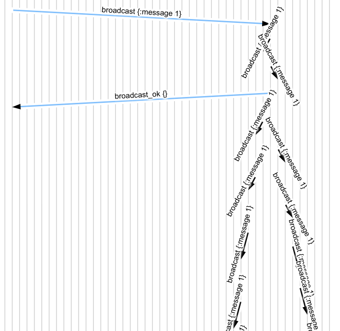

# Broadcast Performance

We've developed a simple broadcast server which relays messages to its
neighbors in a grid, and shown that it correctly broadcasts messages when the
network is healthy. A few questions come to mind:

1. How many messages are exchanged?
2. How *fast* are messages broadcast?
4. What happens when the network isn't healthy?

In this section, we'll address each question in turn, and try out alternative
broadcast mechanisms.

## How Many Messages?

Our tests so far have run for only a few seconds, and performed only a few
operations. That means we don't have as many samples for a good estimate of
network behavior. Let's raise the request rate and time limit to get a better
picture.

```edn
$ ./maelstrom test -w broadcast --bin broadcast.rb --time-limit 20 --rate 100
...
 :net {:stats {...
               :servers {:send-count 9980,
                         :recv-count 9980,
                         :msg-count 9980,
                         :msgs-per-op 5.0125566}}
```

So, with five nodes, we exchange roughly five messages between servers (in
addition to the 2 messages required for the client RPC call) per operation.
What *were* those operations?

```edn
 :stats {:valid? true,
         :count 1991,
         :ok-count 1991,
         :fail-count 0,
         :info-count 0,
         :by-f {:broadcast {:valid? true,
                            :count 998,
                            :ok-count 998,
                            :fail-count 0,
                            :info-count 0},
                :read {:valid? true,
                       :count 993,
                       :ok-count 993,
                       :fail-count 0,
                       :info-count 0}}}
```

This gives us a breakdown of Maelstrom operations by their `:f`--the function
they were trying to perform. We had 998 broadcast requests, and 993 reads--this
workload tries for a 50/50 mix. We know that reads involve no inter-server
traffic, which means we're actually performing roughly 10 inter-server messages
per broadcast, or about 2/node/broadcast.

Looking at messages.svg, you might notice something: we often broadcast a message *back* to the server which sent it to us. That's extra work we don't actually need to perform. Let's add a check to skip it:

```rb
          @neighbors.each do |neighbor|
            unless neighbor == msg[:src]
              @node.send! neighbor, type: "broadcast", message: m
            end
          end
```


```edn
$ ./maelstrom test -w broadcast --bin broadcast.rb --time-limit 20 --rate 100
...
               :servers {:send-count 5916,
                         :recv-count 5916,
                         :msg-count 5916,
                         :msgs-per-op 2.94182}},
```

That's a huge reduction! Removing those unneeded messages cut our network
traffic by ~40%, to ~1.2 messages/node/broadcast. This factor is, of course,
specific to our network topology: recall that Maelstrom arranged our five nodes
in a two-dimensional grid, so nodes have between 1-3 neighbors. If we increased
the number of nodes to, say, a 5x5 grid, we'd expect to see more inter-node
messages--nodes in the middle might have as many as 4 neighbors.

```edn
$ ./maelstrom test -w broadcast --bin broadcast.rb --time-limit 20 --rate 100 --node-count 25
...
               :servers {:send-count 56280,
                         :recv-count 56280,
                         :msg-count 56280,
                         :msgs-per-op 27.806324}}
```

That's ~2.25 messages per node per broadcast: nearly twice as many. This makes
some degree of sense: in the middle of the grid, we expect a message to
propagate sort of like a wave: moving in one direction, with each node
propagating the message to three others. At the edges, that count should fall
off to ~2 neighbors, and at the corners, just one. Our 5x5 grid has 9 central
nodes, 12 edges, and 4 corners: if we take the weighted product of their
expected transmissions, we get ~2.2 messages/node/broadcast. A little extra for
messages that start in the middle of the grid, and propagate initially to 4
neighbors.

What if we were to reduce the number of links between nodes? For instance, we
could arrange our nodes in a straight line, such that each has exactly two
neighbors. It might take fewer messages per broadcast in this kind of topology. We can ask Maelstrom for a linear topology by passing `--topology line`:

```edn
$ ./maelstrom test -w broadcast --bin broadcast.rb --time-limit 20 --rate 100 --node-count 25 --topology line
...
               :servers {:send-count 24120,
                         :recv-count 24120,
                         :msg-count 24120,
                         :msgs-per-op 12.005973}},
```

This dramatically reduces the message burden: each broadcast requires 24
inter-server messages, which is the absolute minimum possible. If we look at
the message flow, we can actually *see* those messages rippling across the
network:



This efficiency comes at a cost, though: it takes *ages* for a message to
propagate to all servers. What happens if a client asks a server for its set of
messages, and the wave hasn't reached it yet?

## Broadcast Latency

Maelstrom's broadcast workload measures not only whether messages are
eventually visible in reads, but how long it took them to get there. Messages
which take some time to appear are called *stale*, and the time it takes before
they're visible in every read is called *stable latency*. You may have seen
stale messages in these tests already, but to make it obvious, we'll add a
little network latency. `--latency 10` tells Maelstrom to wait about ten
milliseconds before delivering each (inter-server) message.

```edn
./maelstrom test -w broadcast --bin broadcast.rb --time-limit 20 --rate 100 --node-count 25 --topology line --latency 10
...
            :attempt-count 959,
            :stable-count 959,
            :stale-count 916,
            :stable-latencies {0 0, 0.5 86, 0.95 170, 0.99 193, 1 224},
```

Out of 959 broadcasts, we were able to observe stale behavior in 916 of them!
That's sort of expected: we return a `broadcast_ok` without trying to confirm
that the message has been acknowledged by anyone else, so of *course* another
client could race ahead to observe another node before the message has
propagated there. But what's worrying here are the `stable-latency` figures.
These are quantiles: 0.5 is the median latency, 1 is the maximum, and so on.
Half of our messages took longer than 86ms to appear across all nodes, and 5%
took longer than 170 ms! One unfortunate message actually took 224 ms to
appear. That's because our linear network topology hands off messages one node
to the next: messages which happen to arrive at one end of the line take 24
hops x 10 ms/hop to propagate completely.

What about the grid topology we started with? Is it more efficient?

```edn
$ ./maelstrom test -w broadcast --bin broadcast.rb --time-limit 20 --rate 100 --node-count 25 --topology grid --latency 10
...
            :stable-latencies {0 0, 0.5 11, 0.95 42, 0.99 56, 1 72},
```

The network latency is still 10ms/hop, but the observed *broadcast* latencies
are dramatically smaller. Median propagation time fell from 86ms to 11ms, and
the tail latencies are ~4x lower. In general, latencies in this kind of
epidemic broadcast model scale with the order of the free path length in the
network, and in a 2d grid, the free path scales as ~sqrt(n), rather than
linearly.

This is partly due to path length: most messages land somewhere in the middle
of the grid, and in the center, it takes just 4 hops to reach the farthest
nodes (the corners). Requests that land at a corners take a full 8 hops to
propagate to the opposite corner. We may not actually *observe* that latency:
our test can only infer broadcast latencies by making requests to nodes, and at
100 ops/sec, we only do 50 reads per second: 2 reads/sec/node. With 500 ms
between reads on each node, it's easy for small latencies to slip through the
cracks. Let's raise the latency to get a better picture of the distribution:

```edn
$ ./maelstrom test -w broadcast --bin broadcast.rb --time-limit 20 --rate 100 --node-count 25 --topology grid --latency 100
...
            :stable-latencies {0 0,
                               0.5 452,
                               0.95 656,
                               0.99 748,
                               1 791},
```

The maximum latency here is ~800 ms, or 8 message delays: exactly as predicted.
those correspond to messages that arrive at a corner node. The median is ~4.5
hops, which is a bit lower than one might expect: it's still being masked by
low sampling rates. If you raise the message latency to ~1000 ms, it'll rise to ~5.5 seconds, which tracks a little better.

An interesting question arises: we know that the grid topology results in
*multiple paths* for a single message to arrive at a node. We've been testing
with a constant 100 ms of latency. What happens if not every message is delayed
by the same amount?

```edn
$ ./maelstrom test -w broadcast --bin broadcast.rb --time-limit 20 --rate 100 --node-count 25 --topology grid --latency 100 --latency-dist exponential
...
            :stable-latencies {0 0,
                               0.5 229,
                               0.95 431,
                               0.99 520,
                               1 630},
```

When message delays are exponentially distributed, some messages have a chance
to take only a few milliseconds, while others take much longer. Since there are
multiple paths to each node, the system as a whole actually gets *faster*!

What would be the *fastest* we could go? What about broadcasting to every other
node immediately? `--topology total` tells Maelstrom to make each node a
neighbor of every other node.

```edn
$ ./maelstrom test -w broadcast --bin broadcast.rb --time-limit 20 --rate 100 --node-count 25 --topology total --latency 100
...
            :stable-latencies {0 0, 0.5 77, 0.95 95, 0.99 96, 1 97},
```

This *flattens* the latency curve: our worst-case propagation time is roughly
one network delay, and observed medians are on the same scale, at 77 ms. Some
messages apparently propagated *instantly*, and the median was 77 ms. We might chalk this up to measurement artifacts: a consequence of our 500-ms
sampling interval. That said, look at the network statistics:

```edn
               :servers {:send-count 587520,
                         :recv-count 587520,
                         :msg-count 587520,
                         :msgs-per-op 290.5638}},
```

Each broadcast results in ~580 network messages: 24 from the first node, and 24
from each of THOSE 24; minus a few duplicates here and there. This is
significantly worse than either the line or grid topologies. Choosing high
numbers of neighbors improves tail latencies, but the traffic costs could prove
prohibitive, and drive up normal network delays.

Is there an approach that balances latency with message costs? What about forming a *spanning tree* over the nodes?

```edn
$ ./maelstrom test -w broadcast --bin broadcast.rb --time-limit 20 --rate 100 --node-count 25 --topology tree4 --latency 100
...
               :servers {:send-count 24744,
                         :recv-count 24744,
                         :msg-count 24744,
                         :msgs-per-op 11.994184}
...
            :stable-latencies {0 0,
                               0.5 386,
                               0.95 489,
                               0.99 498,
                               1 505},

```

The topologies `tree2`, `tree3`, and `tree4` arrange nodes into trees with at
most 2, 3, or 4 children at each branch, respectively. These topologies offer
*optimal* message amplification: just 24 messages to relay a broadcast to all
25 nodes. Their latencies scale as log(nodes), rather than sqrt(nodes): median
*and* tail latencies are significantly better than the `grid` topology. The
worst-case propagation time is governed by the distance from one leaf up to the
root and back down to the most distant leaf, which for a 4-way tree is just 5
hops. Latencies are higher than the total broadcast scheme, of course, but the
reduction in traffic can be well worth it!

## Dealing with Failure

Maelstrom's network can simulate a variety of network partitions: periods where
all messages are lost from one node to another. Let's try introducing some
partitions into our broadcast system.

```clj
$ ./maelstrom test -w broadcast --bin broadcast.rb --time-limit 20 --nemesis partition
...
            :valid? false,
            :lost-count 8,
            :lost (0 1 2 17 27 30 37 39),
            :stable-count 37,
            :stale-count 32,
```

We *lost* broadcast messages! Let's look back at the final reads to see what might have happened:

```clj
INFO [2021-02-24 16:56:48,992] jepsen worker 2 - jepsen.generator.interpreter Waiting for recovery...
INFO [2021-02-24 16:56:58,996] jepsen worker 4 - jepsen.util 4	:invoke	:read	nil
INFO [2021-02-24 16:56:58,996] jepsen worker 2 - jepsen.util 2	:invoke	:read	nil
INFO [2021-02-24 16:56:58,997] jepsen worker 1 - jepsen.util 1	:invoke	:read	nil
INFO [2021-02-24 16:56:58,997] jepsen worker 3 - jepsen.util 3	:invoke	:read	nil
INFO [2021-02-24 16:56:58,997] jepsen worker 0 - jepsen.util 0	:invoke	:read	nil
INFO [2021-02-24 16:56:58,998] jepsen worker 2 - jepsen.util 2	:ok	:read	[3 4 5 6 7 8 9 10 11 12 13 14 15 16 18 19 20 21 22 23 24 25 26 28 29 31 32 33 34 35 36 37 39]
INFO [2021-02-24 16:56:58,998] jepsen worker 4 - jepsen.util 4	:ok	:read	[3 4 5 6 7 8 9 10 11 12 13 14 15 16 18 19 20 21 22 23 24 25 26 28 29 31 32 33 34 35 36]
INFO [2021-02-24 16:56:58,998] jepsen worker 3 - jepsen.util 3	:ok	:read	[0 1 2 17 27 30 32 33 34 35 36 38 40 41 42 43 44]
INFO [2021-02-24 16:56:58,999] jepsen worker 1 - jepsen.util 1	:ok	:read	[3 4 5 6 7 8 9 10 11 12 13 14 15 16 18 19 20 21 22 23 24 25 26 28 29 31 32 33 34 35 36 37 39]
INFO [2021-02-24 16:56:58,999] jepsen worker 0 - jepsen.util 0	:ok	:read	[3 4 5 6 7 8 9 10 11 12 13 14 15 16 18 19 20 21 22 23 24 25 26 28 29 31 32 33 34 35 36 38 40 41 42 43 44]
```

These lists disagree! Some messages, like 0, are present on some nodes, but not
others. This happens despite our redundant grid topology: if enough links are
cut, some nodes simply won't hear about a message. To work around this problem,
we need to *retry*.

We could retry every message indefinitely, but this would be silly: we'd
saturate the network with infinite messages. We need a way to know when to
*stop* retrying. There are lots of ways we can do this--nodes could poll each
other for missing messages, for instance--but let's start with a simple
request-response RPC. We can use the same `msg_id`/`in_response_to` techniques
that Maelstrom's clients use for our own internal purposes.

Our goal is to be able to write something like

```rb
@node.rpc! "n2", {type: "broadcast", message: 3} do |response|
  # stop trying if n2 acknowledged the broadcast
end
```

To do that, we'll need to send a message with a `msg_id`, hang on to a callback
for that request, and when the response arrives, invoke the callback again.
We'll add a `@callbacks` map to our `Node` class:

```rb
  def initialize
    @node_id = nil
    @node_ids = nil
    @next_msg_id = 0

    @handlers = {}
    @callbacks = {}     # New!

    @lock = Monitor.new
    @log_lock = Mutex.new

    # Register an initial handler for the init message
    on "init" do |msg|
      # Set our node ID and IDs
      @node_id = msg[:body][:node_id]
      @node_ids = msg[:body][:node_ids]

      reply! msg, type: "init_ok"
      log "Node #{@node_id} initialized"
    end
  end
```

And an `rpc!` method to send a new RPC request, and record the callback:

```rb
  # Send an async RPC request. Invokes block with response message once one
  # arrives.
  def rpc!(dest, body, &handler)
    @lock.synchronize do
      msg_id = @next_msg_id += 1
      @callbacks[msg_id] = handler
      body = body.merge({msg_id: msg_id})
      send! dest, body
    end
  end
```

Finally, we'll modify our mainloop to look up callbacks whenever we see an
`in_reply_to` message:

```rb
  # Loops, processing messages from STDIN
  def main!
    Thread.abort_on_exception = true

    while line = STDIN.gets
      msg = parse_msg line
      log "Received #{msg.inspect}"

      # What handler should we use for this message?
      handler = nil
      @lock.synchronize do
        if handler = @callbacks[msg[:body][:in_reply_to]] # New!
          @callbacks.delete msg[:body][:in_reply_to]      # New!
        elsif handler = @handlers[msg[:body][:type]]
        else
          raise "No handler for #{msg.inspect}"
        end
      end

      # Actually handle message
      begin
        handler.call msg
      rescue => e
        log "Exception handling #{msg}:\n#{e.full_message}"
      end
    end
  end
```

Now our broadcast handler can keep track of a set of nodes it *wants* to send a
given broadcast message to, and so long as that set is nonempty, keep retrying
those requests. We'll also modify our response code, so that we acknowledge
inter-server broadcast requests in addition to client requests. We've got a
choice between responding immediately or responding after other nodes
acknowledge--it's really up to us to decide. I'll reply immediately here, and
replicate asynchronously.

```rb
    @node.on "broadcast" do |msg|
      # Acknowledge the request
      @node.reply! msg, type: "broadcast_ok"

      # Do we need to process this message?
      m = msg[:body][:message]
      new_message = false
      @lock.synchronize do
        unless @messages.include? m
          @messages.add m
          new_message = true
        end
      end

      if new_message
        # Gossip this message to neighbors
        unacked = @neighbors.dup
        # Except the one who sent it to us; they obviously have the message!
        unacked.delete msg[:src]

        # Keep trying until everyone acks
        until unacked.empty?
          @node.log "Need to replicate #{m} to #{unacked}"
          unacked.each do |dest|
            @node.rpc! dest, {type: "broadcast", message: m} do |res|
              @node.log "Got response #{res}"
              if res[:body][:type] == "broadcast_ok"
                # Good, they've got the message!
                unacked.delete dest
              end
            end
          end
          # Wait a bit before we try again
          sleep 1
        end
        @node.log "Done with message #{m}"
      end
    end
```

Let's try that out.

```
$ ./maelstrom test -w broadcast --bin broadcast.rb --time-limit 20 --topology tree4 --nemesis partition
...
INFO [2021-02-24 17:19:12,535] jepsen worker 2 - jepsen.util 2	:invoke	:broadcast	6
INFO [2021-02-24 17:19:12,537] jepsen worker 2 - jepsen.util 2	:ok	:broadcast	6
INFO [2021-02-24 17:19:12,769] jepsen worker 2 - jepsen.util 2	:invoke	:read	nil
INFO [2021-02-24 17:19:14,813] jepsen worker 3 - jepsen.util 3	:info	:broadcast	1	:net-timeout
INFO [2021-02-24 17:19:14,814] jepsen worker 3 - jepsen.util 8	:invoke	:broadcast	7
INFO [2021-02-24 17:19:15,598] jepsen worker 0 - jepsen.util 0	:fail	:read	nil	:net-timeout
INFO [2021-02-24 17:19:15,599] jepsen worker 0 - jepsen.util 0	:invoke	:read	nil
INFO [2021-02-24 17:19:16,217] jepsen worker 1 - jepsen.util 1	:info	:broadcast	3	:net-timeout
```

Well this is odd. We're seeing timeouts for requests which *should* have responded immediately. What are those nodes doing? Let's check the node logs:

```
Received {:dest=>"n1", :src=>"n4", :body=>{:type=>"broadcast", :message=>0, :msg_id=>1}, :id=>26}
Sent {:dest=>"n4", :src=>"n1", :body=>{:type=>"broadcast_ok", :in_reply_to=>1}}
Sent {:dest=>"n2", :src=>"n1", :body=>{:type=>"broadcast", :message=>0, :msg_id=>1}}
Sent {:dest=>"n3", :src=>"n1", :body=>{:type=>"broadcast", :message=>0, :msg_id=>2}}
Sent {:dest=>"n5", :src=>"n1", :body=>{:type=>"broadcast", :message=>0, :msg_id=>3}}
Sent {:dest=>"n2", :src=>"n1", :body=>{:type=>"broadcast", :message=>0, :msg_id=>4}}
Sent {:dest=>"n3", :src=>"n1", :body=>{:type=>"broadcast", :message=>0, :msg_id=>5}}
Sent {:dest=>"n5", :src=>"n1", :body=>{:type=>"broadcast", :message=>0, :msg_id=>6}}
```

Ahhhh, of course. It's executing the broadcast retry loop--and because it's
busy executing the retry loop, the mainloop never gets a chance to process
another message. We never see the replies to our RPC requests. We need some
kind of concurrency here.

There are lots of options one might use for structuring concurrency in a
distributed systems node--we could use threads, CPS, CSP, actors, promises, a
hand-coded state machine/reactor, etc. We've already done a bit of callback
work here, but for our purposes (writing toy servers which only run for a few
seconds), we're going to use threads. It'll simplify errors and timeouts,
produce more understandable stacktraces, and reduce deeply nested continuation
blocks.

The change we need to make is straightforward: spawn a thread for each request
the mainloop handles. The `Thread.new(handler, msg) do |handler, msg|` notation
ensures that this thread closes over fixed values of `handler` and `msg`,
rather than sharing them as the mainloop goes onto the next message.

```rb
  # Loops, processing messages from STDIN
  def main!
    ...

      # Actually handle message
      Thread.new(handler, msg) do |handler, msg|
        begin
          handler.call msg
        rescue => e
          log "Exception handling #{msg}:\n#{e.full_message}"
        end
      end
    end
  end
```

Let's see what happens:

``` edn
$ ./maelstrom test -w broadcast --bin broadcast.rb --time-limit 20 --topology tree4 --nemesis partition
...
 :net {:stats {:all {:send-count 1277,
                     :recv-count 734,
                     :msg-count 1277,
                     :msgs-per-op 11.104348},
               :clients {:send-count 250,
                         :recv-count 250,
                         :msg-count 250},
               :servers {:send-count 1027,
                         :recv-count 484,
                         :msg-count 1027,
                         :msgs-per-op 8.930435}},
 :workload {...
            :valid? true,
            :lost-count 0,
            :lost (),
            :stable-count 53,
            :stale-count 37,
            :stable-latencies {0 0,
                   0.5 4601,
                   0.95 14575,
                   0.99 15849,
                   1 15849},
            :attempt-count 53,
```

Success! None of our broadcast messages were lost, thanks to the retry loop.
Our latency distribution is much higher, of course: it takes longer for
messages to propagate when the network is partitioned. Likewise, we exchange
more messages per broadcast: it took ~18 messages to replicate a single
broadcast to five nodes, because we had to keep retrying while partitions were
active.

This sums up our work with broadcast systems. Next, we'll look at merging
updates to different nodes by using [CRDTs](/doc/04-crdts/index.md).
