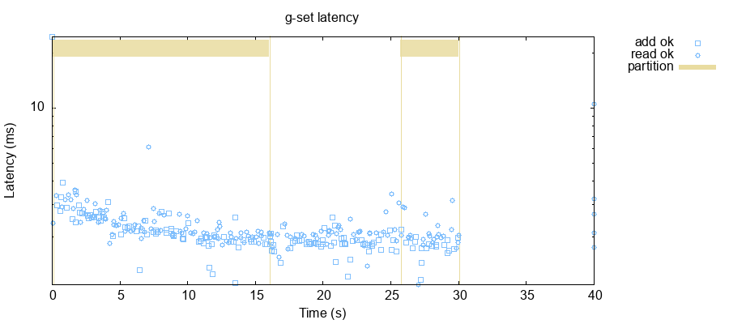

# G-Set

The [g-set workload](/doc/workloads.md#workload-g-set) is almost the same as
the broadcast problem: we want to keep track of a shared, constantly growing
set of elements. Clients issue `add` requests to add an element to the set, and
`read` requests to get all current elements. To do this, we're going to build a
state-based CRDT called a G-Set.

In the [previous chapter](/doc/03-broadcast/index.md) we built a broadcast
system which replicates messages between all nodes. Each node maintained a set
of broadcasted elements, and new elements were incrementally added to that set
via `broadcast` messages. To ensure that every message made it to every node,
we retried broadcasts endlessly until every neighbor had acknowledged the
request.

This raises a few issues. First, we're doing an awful lot of book-keeping on a
per-message basis--keeping track of exactly who needs to receive what updates.
Second, our implementation spawns a thread for each request, which means with
ten thousand incomplete broadcast requests, we have ten thousand threads, each
spamming the network with messages. Could we be more efficient?

## A Simple G-Set

If our set of elements is reasonably small, such that it fits in a single
message, we could do something even more aggressive. Instead of trying to work
out who needs what elements when, we could simply send our *entire* set to our
neighbors periodically. We'll deliver the same elements multiple times, but
that's fine: set union is idempotent.

Let's begin, then, by adding a small task scheduler to `node.rb`. Something
that can handle the periodic broadcast of our state to our neighbors. We'll
keep track of a list of tasks we'd like to run once the node starts, and, once we get an `init` message, spawn threads to run those tasks.

```rb
  def initialize
    @node_id = nil
    @node_ids = nil
    @next_msg_id = 0

    @handlers = {}
    @callbacks = {}
    @periodic_tasks = [] # New!

    @lock = Monitor.new
    @log_lock = Mutex.new

    # Register an initial handler for the init message
    on "init" do |msg|
      # Set our node ID and IDs
      @node_id = msg[:body][:node_id]
      @node_ids = msg[:body][:node_ids]

      reply! msg, type: "init_ok"
      log "Node #{@node_id} initialized"

      # Spawn periodic task handlers
      start_periodic_tasks!
    end
  end
```

We'll add a small method which captures a callback and time interval to the
periodic task list:

```rb
  # Periodically evaluates block every dt seconds with the node lock
  # held--helpful for building periodic replication tasks, timeouts, etc.
  def every(dt, &block)
    @periodic_tasks << {dt: dt, f: block}
  end
```

And to start the tasks, we'll run through each task and start a thread for it.

```rb
  # Launches threads to process periodic handlers
  def start_periodic_tasks!
    @periodic_tasks.each do |task|
      Thread.new do
        loop do
          task[:f].call
          sleep task[:dt]
        end
      end
    end
  end
```

Now let's create a new file for our G-Set node: `g_set.rb`. We'll keep track of
our elements in `@set`, and return its value on reads. For adds, we'll merge
the added value into `@set`.

```rb
class GSetServer
  attr_reader :node
  def initialize
    @node = Node.new
    @lock = Mutex.new
    @set = Set.new

    @node.on "read" do |msg|
      @lock.synchronize do
        @node.reply! msg, type: "read_ok", value: @set.to_a
      end
    end

    @node.on "add" do |msg|
      @lock.synchronize do
        @set.add msg[:body][:element]
      end
      @node.reply! msg, type: "add_ok"
    end
  end
end

GSetServer.new.node.main!
```

We haven't done any kind of inter-node replication yet, but let's see what
happens anyway. We'll have Maelstrom use the `g-set` workload on this binary. In particular, we're looking to make sure that reads and writes can actually execute, and that *some* values get returned:

```
$ ./maelstrom test -w g-set --bin g_set.rb
...
INFO [2021-02-25 10:48:13,039] jepsen worker 3 - jepsen.util 3	:invoke	:add	0
INFO [2021-02-25 10:48:13,042] jepsen worker 3 - jepsen.util 3	:ok	:add	0
INFO [2021-02-25 10:48:13,312] jepsen worker 3 - jepsen.util 3	:invoke	:read	nil
INFO [2021-02-25 10:48:13,315] jepsen worker 3 - jepsen.util 3	:ok	:read	[0]
...
            :lost-count 119,
```

So we lost lots of values (by failing to make them available on all nodes), but
at least local node state is being updated correctly. Now let's figure out how
to replicate state back and forth.

We'll invent a new type of message: `replicate`, which will carry the full
value of the set with it. We won't bother with acknowledgement: if a message is
lost, later attempts will also include all its elements. When we receive a
`replicate` message, we'll take the union of our current set and the sending
node's elements.

```rb
    @node.on "replicate" do |msg|
      @lock.synchronize do
        @set |= msg[:body][:value]
      end
    end
```

Every five seconds, we'll have our node broadcast its state to all other nodes.
Like the broadcast protocol, we could use a more complex topology here to be
more efficient, but this is a good place to start.

```rb
    @node.every 5 do
      set = @lock.synchronize do
        @set.to_a
      end

      @node.log "Replicating current set #{set}"
      @node.node_ids.each do |n|
        # Don't replicate to self
        unless n == @node.node_id
          @node.send! n, type: "replicate", value: set
        end
      end
    end
```

Let's see how that goes:

```clj
$ ./maelstrom test -w g-set --bin g_set.rb --time-limit 10
...
            :valid? true,
            :lost-count 0,
            :lost (),
            :stable-count 19,
            :stale-count 17,
            :stale (0 1 2 3 4 5 6 7 8 11 12 13 14 15 16 17 18),
            :never-read-count 0,
            :stable-latencies {0 0,
                               0.5 2533,
                               0.95 8083,
                               0.99 8083,
                               1 8083},
            :attempt-count 19,
            :never-read (),
            :duplicated {}},
 :valid? true}


Everything looks good! ヽ(‘ー`)ノ
```

Hey, look at that! No writes lost! And check out the network statistics:

```clj
 :net {:stats {:all {:send-count 184,
                     :recv-count 184,
                     :msg-count 184,
                     :msgs-per-op 3.9148936},
               :clients {:send-count 104,
                         :recv-count 104,
                         :msg-count 104},
               :servers {:send-count 80,
                         :recv-count 80,
                         :msg-count 80,
                         :msgs-per-op 1.7021277}},
```

80 inter-server messages to accomplish 19 writes. This is *already* better than
the best broadcast system we designed in the previous chapter, in terms of
message count. Note that we're actually running for 20 seconds here: ten
seconds of mixed reads and writes, plus a ten second quiet period. That's four
replication rounds, times five nodes, times four messages each.

What happens if we ramp up the request rate?

```clj
$ ./maelstrom test -w g-set --bin g_set.rb --time-limit 10 --rate 100
...
 :net {:stats {:all {:send-count 2136,
                     :recv-count 2136,
                     :msg-count 2136,
                     :msgs-per-op 2.1085885},
               :clients {:send-count 2036,
                         :recv-count 2036,
                         :msg-count 2036},
               :servers {:send-count 100,
                         :recv-count 100,
                         :msg-count 100,
                         :msgs-per-op 0.09871668}},
```

The broadcast system we built exchanged messages linear in the number of
broadcast requests. This periodic replication approach has a *constant* number
of messages per second--though of course the messages themselves grow over
time.

The downside, of course, is the latency: our extremely-asynchronous replication
mechanism leads to high latencies: roughly 2.5 seconds median, and as high as
five seconds in extreme cases. (Maelstrom reports latencies as high as ten, but
that's a measurement artifact caused by the quiet period at the end of the
test, where no reads are performed.) We could mitigate this latency by
exchanging messages more frequently, or on *every* new write, like the
broadcast systems we built earlier.

What about network partitions? Can we still make progress when the network is
partitioned? Are writes lost?

```clj
$ ./maelstrom test -w g-set --bin g_set.rb --time-limit 30 --rate 10 --nemesis partition
...
Everything looks good! ヽ(‘ー`)ノ
```

This system delivers *total availability*: even when nodes are partitioned away from the network, reads and writes can still take place. There's no impact on individual request latency!



## A General-Purpose CRDT

Nothing we've done here is all that specific to *sets*, really: it could work
for *any* kind of CRDT. Let's see if we can pull apart the replication system
from the set data structure itself. What would such a G-set look like? For
starters, it'd have a set *somewhere* inside it:

```rb
class GSet
  attr_reader :set

  def initialize(set = Set.new)
    @set = set
  end
end
```

We need a way to serialize and un-serialize this set to a JSON-compatible
representation. We did this implicitly in our `replicate` handlers before, but
now we'll need to be explicit: our sets are represented as JSON arrays.

```rb
class GSet
  ...

  # Returns a new GSet from a JSON representation
  def from_json(json_array)
    GSet.new json_array.to_set
  end

  # Turns a GSet into a JSON representation: an array.
  def to_json
    @set.to_a
  end
end
```

We want a way to render the G-set so that clients can read it. Here, too, we
use an array.

```rb
  # Returns a JSON-serializable representation of the effective value of this
  # GSet.
  def read
    @set.to_a
  end
```

We'll also want a way to *merge* two GSets together, producing a new GSet.

```rb
  # Merging two GSets means taking the set union of their sets.
  def merge(other)
    GSet.new @set.merge(other.set)
  end
```

Finally, we'll want a way to add individual elements to our sets.

```rb
  # Returns a new GSet with this element added.
  def add(element)
    GSet.new(@set | [element])
  end
```

Now, let's replace our `GSetServer`'s set with an empty GSet.

```rb
class GSetServer
  attr_reader :node
  def initialize
    @node = Node.new
    @lock = Mutex.new
    @crdt = GSet.new
    ...
```

In each of our handlers, we'll replace direct set operations with the generic
versions on `@crdt`. Since GSet is immutable, we can also remove some
of our defensive locking.

```rb
    @node.on "read" do |msg|
      @node.reply! msg, type: "read_ok", value: @crdt.read
    end

    @node.on "add" do |msg|
      @lock.synchronize do
        @crdt = @crdt.add msg[:body][:element]
      end
      @node.reply! msg, type: "add_ok"
    end

    @node.on "replicate" do |msg|
      other = @crdt.from_json(msg[:body][:value])
      @lock.synchronize do
        @crdt = @crdt.merge(other)
      end
    end

    @node.every 5 do
      @node.log "Replicating current value #{@crdt.to_json}"
      @node.node_ids.each do |n|
        # Don't replicate to self
        unless n == @node.node_id
          @node.send! n, type: "replicate", value: @crdt.to_json
        end
      end
    end
```

We can double-check that this behaves identically to the hardcoded set:

```rb
$ ./maelstrom test -w g-set --bin g_set.rb --time-limit 20 --rate 10
...
            :stable-latencies {0 0,
                               0.5 2233,
                               0.95 4642,
                               0.99 4844,
                               1 4844},
            :attempt-count 97,
            :never-read (),
            :duplicated {}},
 :valid? true}


Everything looks good! ヽ(‘ー`)ノ
```

Excellent! Now that we have a general-purpose CRDT server, we can implement support for all kinds of datatypes. Let's try a [counter](02-counters.md).
