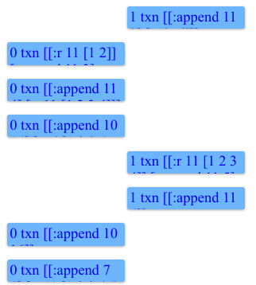
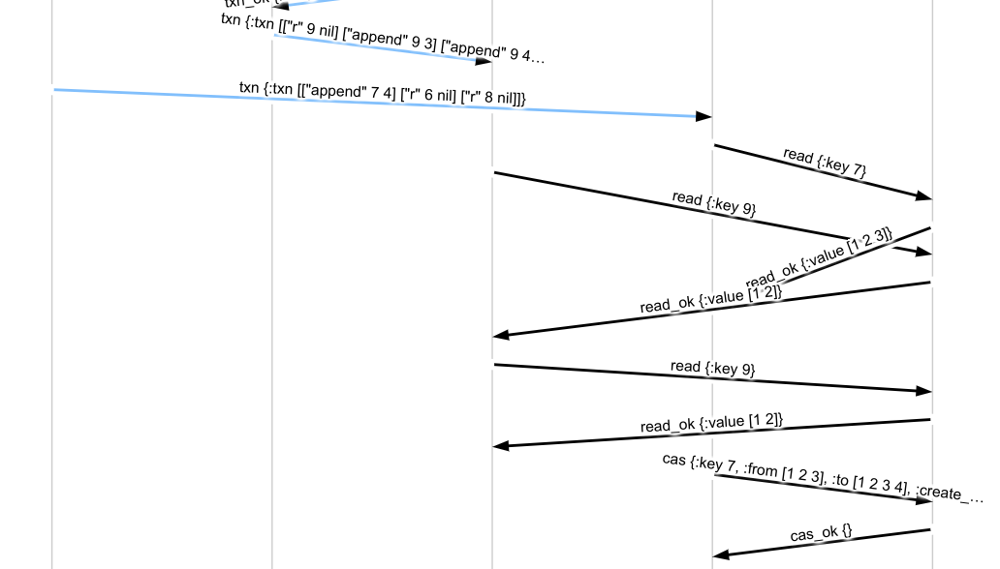

# Shared State

We want to be able to share our key-value state between multiple servers.
Unlike in our CRDT example, where we could exchange state asynchronously, we
need our shared state to be strict serializable. One option would be for us to
build a replicated state machine using a consensus protocol like Raft--indeed,
we'll do that in a later chapter! But getting Raft right is tricky. Instead, we're going to build on top of existing primitives.

If we were building a transactional system in real life, we might take
advantage of an existing linearizable storage system like Zookeeper or Etcd.
Maelstrom comes with one of these *built in*: it's a network service called
[lin-kv](https://github.com/jepsen-io/maelstrom/blob/main/doc/services.md#lin-kv).
Just like a real etcd, we can make read, write, and compare-and-set requests to
the `lin-kv` node on the network, and it guarantees those requests will be
linearizable. So, when it comes time to read or write something in our `State`
class, instead of acting on an in-memory state, we could issue requests to
`lin-kv`.

## Keys in lin-kv

We have an RPC mechanism in our `Node` class already: `rpc!`. However, that
method is asynchronous: it registers a callback which gets invoked once the
promise completes. We'd have to do some awkward state-machine juggling to use
it in a loop like `transact!`. So let's write a *synchronous* variant of that
method.

```rb
class Node
  ...
  # Sends a synchronous RPC request, blocking this thread and returning the
  # response message.
  def sync_rpc!(dest, body)
    p = Promise.new
    rpc! dest, body do |response|
      p.deliver! response
    end
    p.await
  end
```

That *promise* type is a mutable container for data. The `await` method should
block until a value is `deliver!`ed. We'll use a Mutex and a ConditionVariable
to effect that thread handoff.

```rb
class Promise
  WAITING = Object.new
  TIMEOUT = 5

  def initialize
    @lock = Mutex.new
    @cvar = ConditionVariable.new
    @value = WAITING
  end

  # Blocks this thread until a value is delivered, then returns it.
  def await
    if @value != WAITING
      return @value
    end

    # Not ready yet; block
    @lock.synchronize do
      @cvar.wait @lock, TIMEOUT
    end

    if @value != WAITING
      return @value
    else
      raise "promise timed out"
    end
  end

  def deliver!(value)
    @value = value
    @lock.synchronize do
      @cvar.broadcast
    end
    self
  end
end
```

Note in particular that we have a hardcoded `TIMEOUT` here. We don't want our
nodes blocking forever when they can't get a response to an RPC request.

Now, let's return to our `State` class. We'll get rid of the internal `@state`
map, and give it a reference to our `Node`, so it can issue RPC requests
to the `lin-kv` service.

```rb
class State
  def initialize(node)
    @node = node
  end
  ...
end

class Transactor
  attr_reader :node

  def initialize
    @node = Node.new
    @lock = Mutex.new
    @state = State.new @node

    ...
```

Now, what do we do about the transact! method?

```rb
  def transact!(txn)
    txn2 = []
    txn.each do |op|
      f, k, v = op
      case f
      when 'r'
        # ???
```

The value of key `k` will be stored in `lin-kv`, so we should issue a read
request:

```rb
      when 'r'
        list = @node.sync_rpc!('lin-kv', {
          type: 'read',
          key: k
        })[:body][:value]

        txn2 << [f, k, list]
```

What about writes? `lin-kv` doesn't *have* an `append` operation natively...
but we could read the current value, modify it, and write it back using a
compare-and-set! That'd give us atomic list append!

Note `create_if_not_exists` is supported by the _service_ `lin-kv`, which is
different than the _workload_. Reference the [service documentation](https://github.com/jepsen-io/maelstrom/blob/main/doc/services.md) for using built-in services.

```rb
      when 'append'
        txn2 << op

        # Get current value of k
        list1 = @node.sync_rpc!('lin-kv', {
          type: 'read',
          key: k
        })[:body][:value]

        # Create a copy with our appended v
        list2 = (list1.clone or [])
        list2 << v

        # And write it back iff it hasn't changed
        res = @node.sync_rpc!('lin-kv', {
          type: 'cas',
          key: k,
          from: list1,
          to: list2,
          create_if_not_exists: true
        })
        unless res[:body][:type] == 'cas_ok'
          raise "CAS of #{k} failed!"
        end
      end
```

Let's give that a shot:

```clj
$ ./maelstrom test -w txn-list-append --bin datomic.rb --time-limit 10 --node-count 2
...
2021-02-26 11:42:48,806{GMT}	INFO	[jepsen worker 1] jepsen.util: 1	:invoke	:txn	[[:r 1 nil] [:append 9 11]]
2021-02-26 11:42:48,813{GMT}	INFO	[jepsen worker 1] jepsen.util: 1	:ok	:txn	[[:r 1 nil] [:append 9 11]]
2021-02-26 11:42:48,914{GMT}	INFO	[jepsen worker 0] jepsen.util: 0	:invoke	:txn	[[:r 2 nil] [:r 6 nil] [:r 9 nil]]
2021-02-26 11:42:48,921{GMT}	INFO	[jepsen worker 0] jepsen.util: 0	:ok	:txn	[[:r 2 nil] [:r 6 [1 2]] [:r 9 [1 2 3 4 5 6 7 8 9 10 11]]]
...
Everything looks good! ヽ(‘ー`)ノ
```

Look at that! We've got two different workers, talking to two distinct nodes,
which are able to share the state of keys! Worker 1 appends 11 to key 9, and
worker 0 reads that append of key 11. The history as a whole is strict
serializable!

Let's take a look at `timeline.html`, to get a picture of how concurrent these
histories are:



Ah, so... we never actually executed two transactions at the same time. Let's turn up the request rate and see what happens:

```clj
$ ./maelstrom test -w txn-list-append --bin datomic.rb --time-limit 10 --node-count 2 --rate 100

            :anomaly-types (:G-single :G1b :internal),
            ...
            :not #{:read-atomic :read-committed},
            :also-not #{:ROLA
                        :causal-cerone
                        :consistent-view
                        :cursor-stability
                        :forward-consistent-view
                        :monotonic-atomic-view
                        :monotonic-snapshot-read
                        :monotonic-view
                        :parallel-snapshot-isolation
                        :prefix
                        :repeatable-read
                        :serializable
                        :snapshot-isolation
                        :strict-serializable
                        :strong-session-serializable
                        :strong-session-snapshot-isolation
                        :strong-snapshot-isolation
                        :update-serializable}},
 :valid? false}

Analysis invalid! (ﾉಥ益ಥ）ﾉ ┻━┻
```

Well... that's *something* of an improvement. We don't have incompatible orders any more: the linearizable KV store is guaranteeing that all our updates to a single key are well-ordered. However, we're still seeing internal consistency violations. Why?

```clj
  :internal ({:op {:type :ok,
                   :f :txn,
                   :value [[:r 51 [1 2 3 4 5 6 7 8 9 10 11 12 13 14 15]]
                           [:r 51 [1 2 3 4 5 6 7 8 9 10 11 12 13 14 15 16]]],
                   :time 6082174210,
                   :process 2,
                   :index 1256},
```

Ah, so that's a problem. This transaction executed two consecutive reads, and
the value *changed* between those two reads--despite the transaction not
actually writing anything. Some other transaction must have snuck in and
modified the value of key 51 while this one was executing. And indeed, in
`messages.svg`, we can *see* both transactors (middle) interacting with lin-kv
(far right) concurrently:



# Database As Value

The fundamental problem here is that we're updating multiple keys in-place.
What if we stored the *entire database* under a single key? Then we wouldn't
have to worry about coordinating updates to distinct keys. Let's create an
immutable `Map` class which can store our entire database state as a single,
JSON-serializable value.

```rb
class Map
  def initialize(map = {})
    @map = map
  end

  # To re-inflate a Map from a JSON representation, we construct a Hashmap of
  # pairs.
  def self.from_json(json)
    if json
      Map.new Hash[json]
    else
      Map.new {}
    end
  end

  # Turns this Map into a JSON object. We serialize ourselves as a list of
  # pairs, so that our keys can be any type of object, not just strings.
  def to_json
    @map.entries
  end

  # Get the value of key k
  def [](k)
    @map[k]
  end

  # Return a copy of this Map with k = v
  def assoc(k, v)
    Map.new @map.merge({k => v})
  end
```

Instead of mutating Maps in place, we'll have a pure version of the `transact!` method, which takes one Map to another by applying a transaction:

```rb
  # Applies txn to this Map, returning a tuple of the resulting Map and the
  # completed transaction.
  def transact(txn)
    txn2 = []
    map2 = txn.reduce(self) do |m, op|
      f, k, v = op
      case f
      when "r"
        txn2 << [f, k, m[k]]
        m
      when "append"
        txn2 << op
        list = (m[k].clone or [])
        list << v
        m.assoc k, list
      end
    end

    [map2, txn2]
  end
end
```

Moving this logic into the `Map` class frees up `State` to worry only about
loading and saving the Map from `lin-kv`. We'll define a single key, `"root"`,
to store the current value of the database.

```rb
class State
  # Where do we store the DB state in lin-kv?
  KEY = 'root'

  def initialize(node)
    @node = node
  end

  def transact!(txn)
    # Load the current value from lin-kv
    map1 = Map.from_json(
      @node.sync_rpc!('lin-kv', {
        type: 'read',
        key: KEY
      })[:body][:value]
    )

    # Apply txn
    map2, txn2 = map1.transact txn

    # Save resulting state iff it hasn't changed
    res = @node.sync_rpc!('lin-kv', {
      type: 'cas',
      key:  KEY,
      from: map1.to_json,
      to:   map2.to_json,
      create_if_not_exists: true
    })
    unless res[:body][:type] == 'cas_ok'
      raise "CAS failed!"
    end

    txn2
  end
end
```

Let's give that a try:

```clj
./maelstrom test -w txn-list-append --bin datomic.rb --time-limit 10 --node-count 2 --rate 100
...
Everything looks good! ヽ(‘ー`)ノ

```

This actually works! Storing the entire database as a single value, inside of a
linearizable KV store, gives us strict serializability. Indeed, strict
serializability *is* linearizability, where the linearizable "object" is a
transactional database. And that's exactly what we've done!

## Error Handling

You may have noticed that not all of our transactions succeeded: some crashed
with type `:info`.

```clj
 :stats {:valid? true,
         :count 1013,
         :ok-count 1011,
         :fail-count 0,
         :info-count 2,
```

What happened to those transactions?

```clj
$ grep :info store/latest/history.edn
{:type :info, :f :txn, :value [[:append 9 11] [:append 6 3]], :time 5246977350, :process 0, :error :net-timeout, :index 1043}
{:type :info, :f :txn, :value [[:r 40 nil] [:append 40 13]], :time 10293060397, :process 1, :error :net-timeout, :index 2025}
```

Aha! They had a network timeout. Why didn't the server send back a response?
Let's check the node logs and see if anything is out of the ordinary.

```clj
$ less store/latest/node-logs/n0.log
...
Exception handling {:dest=>"n0", :body=>{:txn=>[["append", 9, 11], ["append", 6, 3]], :type=>"txn", :msg_id=>9}, :src=>"c5", :id=>121}:
/home/aphyr/maelstrom/datomic.rb:87:in `transact!': CAS failed! (RuntimeError)
        from /home/aphyr/maelstrom/datomic.rb:106:in `block (2 levels) in initialize'
        from /home/aphyr/maelstrom/datomic.rb:105:in `synchronize'
        from /home/aphyr/maelstrom/datomic.rb:105:in `block in initialize'
        from /home/aphyr/maelstrom/node.rb:139:in `block in main!'
Received {:dest=>"n0", :body=>{:txn=>[["append", 37, 9], ["r", 43, nil]], :type=>"txn", :msg_id=>10}, :src=>"c5", :id=>3135}
```

Aha! When our compare-and-set fails, we throw an exception. The `Node` mainloop
logs that exception, but doesn't tell the client anything about it. It'd be
nice if we sent back a proper error message. The [protocol error
docs](/doc/protocol.md#errors) gives a variety of error types that look helpful.

In `node.rb`, let's add an RPCError class.

```rb
class RPCError < StandardError
  class << self
    def timeout(msg);           new 0,  msg; end
    def not_supported(msg);     new 10, msg; end
    def temporarily_unavailable(msg); new 11, msg; end
    def malformed_request(msg); new 12, msg; end
    def crash(msg);             new 13, msg; end
    def abort(msg);             new 14, msg; end
    def key_does_not_exist(msg) new 20, msg; end
    def precondition_failed(msg) new 22, msg; end
    def txn_conflict(msg);      new 30, msg; end
  end

  attr_reader :code

  def initialize(code, text)
    @code = code
    @text = text
    super(text)
  end

  # Constructs a JSON error response
  def to_json
    {type: "error",
     code: @code,
     text: @text}
  end
end
```

Now we can throw a variety of errors with friendly names, and have the mainloop
serialize them to JSON responses. In `Node#mainloop!`, we'll replace our
message handler logic with one that sends back replies.

```rb
      # Actually handle message
      Thread.new(handler, msg) do |handler, msg|
        begin
          handler.call msg
        rescue RPCError => e
          reply! msg, e.to_json
        rescue => e
          log "Exception handling #{msg}:\n#{e.full_message}"
          reply! msg, RPCError.crash(e.full_message).to_json
        end
```

Now, any exception in a message handler returns a nice `crash` message (and a stacktrace!) to Maelstrom--and shows up in the history!

```clj
$ ./maelstrom test -w txn-list-append --bin datomic.rb --time-limit 10 --node-count 2 --rate 100
...
INFO [2021-02-26 13:13:46,251] jepsen worker 1 - jepsen.util 145	:info	:txn	[[:append 82 11] [:r 82 nil] [:append 79 16]]	[:crash "/home/aphyr/maelstrom/datomic.rb:87:in `transact!': CAS failed! (RuntimeError)\n\tfrom /home/aphyr/maelstrom/datomic.rb:106:in `block (2 levels) in initialize'\n\tfrom /home/aphyr/maelstrom/datomic.rb:105:in `synchronize'\n\tfrom /home/aphyr/maelstrom/datomic.rb:105:in `block in initialize'\n\tfrom /home/aphyr/maelstrom/node.rb:165:in `block in main!'\n"]
```

We can also be more specific when a CAS fails by returning a `txn-conflict`
error. In `State#transact!`, we'll say:

```rb
    unless res[:body][:type] == 'cas_ok'
      raise RPCError.txn_conflict "CAS failed!"
    end
```

Begone, stacktraces!

```clj
$ ./maelstrom test -w txn-list-append --bin datomic.rb --time-limit 10 --node-count 2 --rate 100
...
INFO [2021-02-26 13:18:17,751] jepsen worker 0 - jepsen.util 0	:fail	:txn	[[:append 79 3] [:append 79 4] [:r 78 nil]]	[:txn-conflict "CAS failed!"]
```

Right! With that housekeeping taken care of, it's onwards, to [Persistent Trees](03-persistent-trees.md)!
