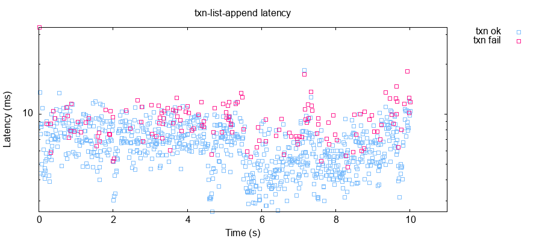
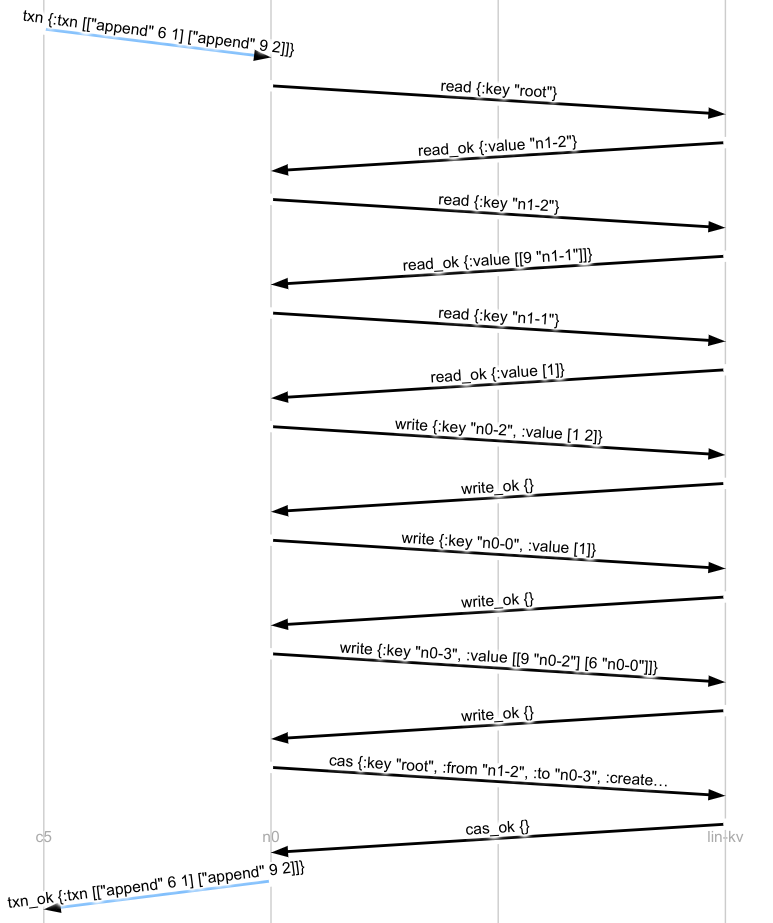

# Persistent Trees

We got to a strict-serializable solution by cramming the *entire database* into
a single key in a linearizable key-value store. That... works, but it might be
inefficient. In particular, that state is constantly growing over time, and
that means our transactions get slower and slower over time--just from having
to serialize and deserialize an ever-larger state. We can see this in the
`latency-raw.png` plots.


In this section, we'll *break up* our state into little bits, while retaining
the same strict-serializable safety properties.

## Keys As Thunks

The safety properties we have right now are guaranteed by the linearizable
compare-and-set of the `root` key, where all our data lives. But there's no
reason the actual data *needs* to live in root itself. We could store a
*pointer* to that data--maybe one pointer per key--and fetch it asynchronously.
That way, we'd avoid serializing the entire world for every transaction. We'd
only need to load and store the things that *changed*.

To do this, we're going to need a place to store those values. Let's create an
ID generator class, which uses a node's ID and an atomic counter to generate
globally unique IDs.

```rb
class IDGen
  def initialize(node)
    @node = node
    @lock = Mutex.new
    @i = -1
  end

  # Generates a new unique ID
  def new_id
    i = @lock.synchronize do
      @i += 1
    end
    "#{@node.node_id}-#{i}"
  end
end
```

Now we want some sort of lazy value to put as the entries in our
maps--something which *could* load data from the storage service, but only if
requested. Following Haskell, we'll call this class a Thunk. We'll keep track
of whether it's been saved or not, so we don't have to save Everything Every
Time.

```rb
class Thunk
  SVC = 'lin-kv'

  def initialize(node, id, value, saved)
    @node = node
    @id = id
    @value = value
    @saved = saved
  end

  # Returns this thunk's ID, creating a new one if necessary.
  def id
    @id ||= @idgen.new_id
  end

  # Returns the value of this thunk from the storage service.
  def value
    @value ||= @node.sync_rpc!(SVC, {
      type: 'read',
      key: id
    })[:body][:value]
  end

  # Saves this thunk to the storage service
  def save!
    unless @saved
      res = @node.sync_rpc! SVC, type: 'write', key: id, value: @value
      if res[:body][:type] == 'write_ok'
        @saved = true
      else
        raise RPCError.abort "Unable to save thunk #{id}"
      end
    end
  end
end
```

Now, let's think about our immutable Maps. Instead of storing them as a list of
`[key, value]` pairs, we'll store them as `[key, thunk-id]` pairs. When we
inflate a Map from storage, we'll create a map of keys to unrealized
Thunks--their values will only be retrieved if needed.

```rb
class Map
  def initialize(node, idgen, map = {})
    @node = node
    @idgen = idgen
    @map = map
  end

  # We have a list of [k, id] pairs, each id belonging to a saved Thunk.
  def self.from_json(node, idgen, json)
    pairs = json || []
    m = {}
    pairs.each do |k, id|
      m[k] = Thunk.new node, id, nil, true
    end
    Map.new node, idgen, m
  end

  # Turns this Map into a JSON object. We serialize ourselves as a list of
  # [k, thunk-id] pairs, so that our keys can be any type of object, not just
  # strings.
  def to_json
    @map.entries.map do |k, thunk|
      [k, thunk.id]
    end
  end
```

We'll also need a way to save all the thunks used in a map, so we can write the
map safely to storage.

```rb
  # Saves this Map's thunks to the storage service
  def save!
    @map.values.each do |thunk|
      thunk.save!
    end
  end
```

Our getters and setters need only slight changes: when reading, we ask the
Thunk for its value, and when writing, we create a new, unsaved Thunk, with a
fresh ID.

```rb
  # Get the value of key k
  def [](k)
    if v = @map[k]
      v.value
    end
  end

  # Return a copy of this Map with k = v
  def assoc(k, v)
    thunk = Thunk.new @node, @idgen.new_id, v, false
    Map.new @node, @idgen, @map.merge({k => thunk})
  end
```

Our transact method is exactly the same as before: we reduce through the given
transaction, building up a new Map. Only now, under the hood, we'll have constructed a map built out of lazy Thunks, ready to be saved.

```rb
  # Applies txn to this Map, returning a tuple of the resulting Map and the
  # completed transaction.
  def transact(txn)
    txn2 = []
    map2 = txn.reduce(self) do |m, op|
      f, k, v = op
      case f
      when "r"
        txn2 << [f, k, m[k]]
        m
      when "append"
        txn2 << op
        list = (m[k].clone or [])
        list << v
        m.assoc k, list
      end
    end

    [map2, txn2]
  end
end
```

Our mutable `State` class will now *also* keep track of a node and id generator.

```rb
class State
  # Where do we store the root DB state?
  SVC = 'lin-kv'
  KEY = 'root'

  def initialize(node, idgen)
    @node = node
    @idgen = idgen
  end
```

And when it comes time to execute a transaction, we'll make sure to thread that
node and idgen into the Map loader. We also need to `save!` the map before
trying to CaS it to a new value: we don't want to create a map with thunks that
nobody else can read.

```rb
  def transact!(txn)
    # Load the current value from lin-kv
    map1 = Map.from_json(@node, @idgen,
      @node.sync_rpc!('lin-kv', {
        type: 'read',
        key: KEY
      })[:body][:value]
    )

    # Apply txn
    map2, txn2 = map1.transact txn

    # Save resulting state iff it hasn't changed
    map2.save!
    res = @node.sync_rpc!('lin-kv', {
      type: 'cas',
      key:  KEY,
      from: map1.to_json,
      to:   map2.to_json,
      create_if_not_exists: true
    })
    unless res[:body][:type] == 'cas_ok'
      raise RPCError.txn_conflict "CAS failed!"
    end

    txn2
  end
end
```

Finally, when we create our Transactor, we'll also create an ID service, and pass it to the initial State.

```rb
class Transactor
  attr_reader :node

  def initialize
    @node = Node.new
    @lock = Mutex.new
    idgen = IDGen.new @node
    @state = State.new @node, idgen

    @node.on 'txn' do |msg|
      txn = msg[:body][:txn]
      @node.log "\nTxn: #{txn}"
      txn2 = @lock.synchronize do
        @state.transact! txn
      end
      @node.reply! msg, type: "txn_ok", txn: txn2
    end
  end
end
```

Phew! That was a lot of work! But if all goes well, we should have an honest-to-gosh strict-serializable data store--with values split out into their own, immutable, lazy thunks.

```clj
$ ./maelstrom test -w txn-list-append --bin datomic.rb --time-limit 10 --node-count 2 --rate 100
...
Everything looks good! ヽ(‘ー`)ノ
```

And if we look at the resulting transaction latencies... they're no longer
(obviously) growing linearly:



We expect *some* growth still--every time we add a new key to the test, there's
one more element we have to store in the root map. But when the values in the
map are large, this approach means we only have to load the data we actually
care about for each transaction, and *that* can significantly improve latency.

## Maps as Thunks

We've successfully moved the values in our map into their own thunks--but the
*keys* themselves are still stored in the root database pointer, and that
slowly grows over time as more keys are added. What if we wanted to keep the
root pointer small? Could we make the *entire map* a thunk, too?

A small change to our Thunk class: instead of saving the value directly to/from
the storage service, we'll add methods which convert between the in-memory value and the JSON version that we write to storage.

```rb
class Thunk
  ...

  # By default, thunks serialize their entire value to/from JSON directly.
  def to_json
    @value
  end

  def from_json(json)
    json
  end
```

When Thunks are asked for their values, or save their values, they use those
`to_json` and `from_json` methods to convert back and forth.

```rb
class Thunk
  ...

  # Returns the value of this thunk from the storage service.
  def value
    unless @value
      res = @node.sync_rpc! SVC, type: 'read', key: id
      value = from_json res[:body][:value]
      @value ||= value
    end
    @value
  end

  # Saves this thunk to the storage service
  def save!
    unless @saved
      res = @node.sync_rpc! SVC, type: 'write', key: id, value: to_json
      if res[:body][:type] == 'write_ok'
        @saved = true
      else
        raise RPCError.abort "Unable to save thunk #{id}"
      end
    end
  end
```

Now we can make `Map` a *subclass* of `Thunk`, and inherit its
lazy-loading/saving behavior.

```rb
class Map < Thunk
  def initialize(node, idgen, id, value, saved)
    super node, id, value, saved
    @idgen = idgen
  end
```

We'll replace the `Map.from_json` class method with an instance method, letting
`Thunk#value` take over our deserialization. Note that we don't need to
construct a full Map object here--we return the new `@value`, which the Thunk
machinery loads for us.

```rb
  # We have a list of [k, id] pairs, each id belonging to a saved Thunk.
  def from_json(json)
    pairs = json || []
    m = {}
    pairs.each do |k, id|
      m[k] = Thunk.new @node, id, nil, true
    end
    m
  end
```

We replace references to @map with `value`, and update our `save!` function to
save the Map after all its values have been saved.

```rb
  # Turns this Map into a JSON object. We serialize ourselves as a list of
  # [k, thunk-id] pairs, so that our keys can be any type of object, not just
  # strings.
  def to_json
    value.entries.map do |k, thunk|
      [k, thunk.id]
    end
  end

  # Saves this Map's thunks to the storage service
  def save!
    value.values.each do |thunk|
      thunk.save!
      super
    end
  end

  # Get the value of key k
  def [](k)
    if v = value[k]
      v.value
    end
  end
```

When we `assoc`, we construct a new Map with its own fresh ID, in addition to
the new thunk.

```rb
  # Return a copy of this Map with k = v
  def assoc(k, v)
    thunk = Thunk.new @node, @idgen.new_id, v, false
    Map.new @node, @idgen, @idgen.new_id, value.merge({k => thunk}), false
  end
```

Finally, we need to re-work our `State` class: instead of loading the Map
directly from JSON, it should create a Map thunk, and let the Map handle
loading itself when asked. Instead of storing the entire Map in the root, we'll
store *just* the identifier.

```rb
class State
  # Where do we store the root DB state?
  SVC = 'lin-kv'
  KEY = 'root'

  def initialize(node, idgen)
    @node = node
    @idgen = idgen
  end

  def transact!(txn)
    # Load the current map id from lin-kv
    map_id1 = @node.sync_rpc!('lin-kv', {
      type: 'read',
      key: KEY
    })[:body][:value]

    map1 = if map_id1
             Map.new(@node, @idgen, map_id1, nil, true)
           else
             Map.new(@node, @idgen, @idgen.new_id, {}, false)
           end

    # Apply txn
    map2, txn2 = map1.transact txn

    # Save resulting state iff it hasn't changed
    if map1.id != map2.id
      map2.save!
      res = @node.sync_rpc!(SVC, {
        type: 'cas',
        key:  KEY,
        from: map1.id,
        to:   map2.id,
        create_if_not_exists: true
      })
      unless res[:body][:type] == 'cas_ok'
        raise RPCError.txn_conflict "CAS failed!"
      end
    end

    txn2
  end
end
```

Is the resulting server still strict-serializable? Let's check:

```clj
$ ./maelstrom test -w txn-list-append --bin datomic.rb --time-limit 10 --node-count 2 --rate 100
...
Everything looks good! ヽ(‘ー`)ノ
```

Indeed, it is! We can even see the algorithm at work in `messages.svg`. Here, a
transaction wants to append 1 to key 6, and 2 to key 9. The `State` fetches the
current root pointer, obtaining `n1-2`. It fetches the map stored at `n1-2`,
which expands into a key-value pair: key 9's current value is stored in `n1-1`.
It fetches `n1-1`, finding the current list `[1]`, and so on. When the
transaction is complete, the Map writes each modified Thunk, then itself, and
finally, the State updates the root pointer via `cas`.



We can represent an entire database as a single pointer, and obtain arbitrary
strict-serializable transactions over that database state.

Next, we'll look at ways to [optimize](04-optimization.md) this approach.
