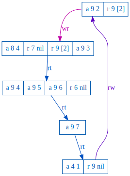
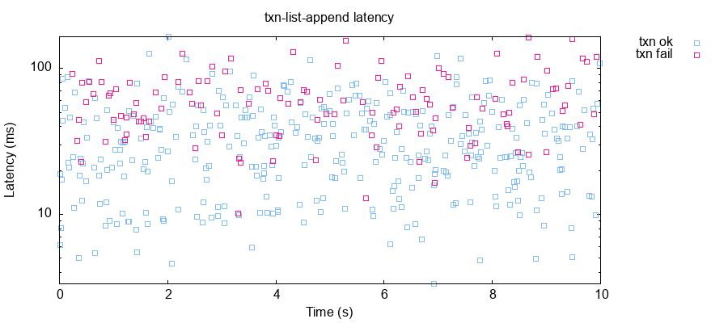
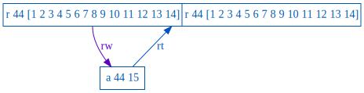

# Optimization

## Eventual Consistency

In the previous section, we moved our map values into lazy thunks, each one
read separately from storage. However, each value was stored in the `lin-kv`
service, and in the real world, providing linearizability might be expensive.
Since our thunks are immutable, could we move them into an
eventually-consistent store instead?

```rb
class Thunk
  SVC = 'lww-kv'
```

The `lww-kv` service works exactly like `lin-kv`, but uses last-write-wins
eventual consistency, like Cassandra. Let's see what happens.

```rb
$ ./maelstrom test -w txn-list-append --bin datomic.rb --time-limit 10 --node-count 2 --rate 1
...
            :anomaly-types (:G-single-realtime),
            :not #{:strict-serializable},
            :also-not #{}},
 :valid? false}


Analysis invalid! (ﾉಥ益ಥ）ﾉ ┻━┻
```

Well that's... odd. A G-single-realtime anomaly means that Maelstrom was able
to find a dependency cycle including one write -> read edge *and* at least one
realtime edge. The fact that it's a *realtime* anomaly tells us that timing was
important: the history was serializable, but somewhere, a transaction observed
a legal state *from the past*.



This plot, from `elle/G-single-realtime/0.svg`, shows the anomaly that my
particular test found--yours may vary. Each segmented rectangle is a single
transaction: `a 9 2` means "append 2 to key 9" and `r 9 [2]` means "read key
9's value as [2]". Edges show dependencies between transactions: `rt` means
that one transaction completed before another began, `wr` means that one
transaction wrote something another observed, and `rw` means that one
transaction observed a state overwritten by a later transaction.

At the bottom of this plot we have a pair of transactions: one appends 7 to key
9, and strictly later, in real time, another reads key 9, and sees `nil`--it
failed to observe the previous transaction's effects. Let's take a look at `messages.svg` to see what might have happened.


The second transaction tried to read the root pointer, and succeeded: it found
the map stored in `n1-8`, and in there, a reference to key 9's value stored in
`n1-7`. However, the `lww-kv` store responded with a `not-found` error for our
read. We were sloppy before, and assumed that reads would always observe the
latest state--but this isn't necessarily the case in an eventually consistent
store. We need to *retry* when values are missing.

```rb
class Thunk
  ...
  def value
    until @value
      res = @node.sync_rpc! SVC, type: 'read', key: id
      if res[:body][:type] == 'read_ok'
        value = from_json res[:body][:value]
        @value ||= value
      else
        # Read failed, retry
        sleep 0.01
      end
    end
    @value
  end
```

```clj
$ ./maelstrom test -w txn-list-append --bin datomic.rb --time-limit 10 --node-count 2 --rate 100
...
Everything looks good! ヽ(‘ー`)ノ
```

If we look at the Lamport diagrams, we can see nodes retrying failed reads over
and over again. The LWW store in Maelstrom is intentionally *awful*, which
means it may take several tries before a write becomes visible. That pushes up
our latency, and the number of messages we have to exchange:



```clj
 :net {:stats {:all {:send-count 9280,
                     :recv-count 9280,
                     :msg-count 9280,
                     :msgs-per-op 19.61945},
               :clients {:send-count 950,
                         :recv-count 950,
                         :msg-count 950},
               :servers {:send-count 8330,
                         :recv-count 8330,
                         :msg-count 8330,
                         :msgs-per-op 17.610994}},
```

17.6 messages per transaction... even considering the awful LWW KV store,
that's a lot of RPC calls! The obvious question is: can we go faster?

## Caching Thunks

Because our thunks are immutable, we can always cache them safely. Let's try
adding a cache to our Thunk class, and re-using values from the cache whenever
possible.

```rb
class Thunk
  SVC = 'lin-kv'

  @@cache = {}

  # Loads a thunk from the local cache. If not found in cache, evaluates block
  # to construct a new Thunk, and saves that in the cache.
  def self.cached(id)
    @@cache[id] or (@@cache[id] = yield)
  end
```

Now we can modify `Map#from_json` to try loading thunks from cache, if
possible.

```rb
  # We have a list of [k, id] pairs, each id belonging to a saved Thunk.
  def from_json(json)
    pairs = json || []
    m = {}
    pairs.each do |k, id|
      m[k] = Thunk.cached(id) do
        Thunk.new @node, id, nil, true
      end
    end
    m
  end
```

And likewise for fetching Maps in `State#transact!`:

```rb
  def transact!(txn)
    # Load the current map id from lin-kv
    map_id1 = @node.sync_rpc!('lin-kv', {
      type: 'read',
      key: KEY
    })[:body][:value]

    map1 = if map_id1
             Thunk.cached(map_id1) do
               Map.new(@node, @idgen, map_id1, nil, true)
             end
           else
             Map.new(@node, @idgen, @idgen.new_id, {}, false)
           end
```

Now we don't have to re-fetch data that hasn't changed since the last time we
read it!

```clj
$ ./maelstrom test -w txn-list-append --bin datomic.rb --time-limit 10 --node-count 2 --rate 100
...
               :servers {:send-count 9458,
                         :recv-count 9458,
                         :msg-count 9458,
                         :msgs-per-op 14.550769}},
```

Not incredible, but still nothing to sneeze at! We shaved off roughly three messages per transaction.

## Caching the Root

Another optimization: it might be possible for us to *guess* that the state of
the root pointer hasn't changed since we last executed, and avoid having to
fetch it for every transaction. We can add a `map` field to our `State`
class, like so:

```rb
class State
  # Where do we store the root DB state?
  SVC = 'lin-kv'
  KEY = 'root'

  def initialize(node, idgen)
    @node = node
    @idgen = idgen
    # Start with an empty state
    @map = Map.new(@node, @idgen, @idgen.new_id, {}, false)
  end
```

And when we transact, we'll run our transaction on the cached Map, hoping that
it's still current. If we lose, we can always pull the latest map and retry.

```rb
  def transact!(txn)
    while true
      # Apply transaction speculatively
      map2, txn2 = @map.transact txn

      # Save resulting map
      map2.save!
      res = @node.sync_rpc!(SVC, {
        type: 'cas',
        key:  KEY,
        from: @map.id,
        to:   map2.id,
        create_if_not_exists: true
      })
      if res[:body][:type] == 'cas_ok'
        # Done!
        @map = map2
        return txn2
      end
      # Shoot, we lost the cas; back off and retry.
      sleep(rand * 0.05)
      update_map!
    end
  end
```

Let's see what happens!

```clj
$ ./maelstrom test -w txn-list-append --bin datomic.rb --time-limit 10 --node-count 2 --rate 10
...
 :stats {:valid? true,
         :count 1006,
         :ok-count 1006,
         :fail-count 0,
         :info-count 0,
         :by-f {:txn {:valid? true,
                      :count 1006,
                      :ok-count 1006,
                      :fail-count 0,
                      :info-count 0}}},
 :net {:stats {:all {:send-count 10574,
                     :recv-count 10574,
                     :msg-count 10574,
                     :msgs-per-op 10.510935},
               :clients {:send-count 2016,
                         :recv-count 2016,
                         :msg-count 2016},
               :servers {:send-count 8558,
                         :recv-count 8558,
                         :msg-count 8558,
                         :msgs-per-op 8.506958}},
       :valid? true},
 :workload {:valid? true},
 :valid? true}


Everything looks good! ヽ(‘ー`)ノ
```

Three incredible things happened.

1. Adding a retry loop eliminated our cas failure messages. Every single
   transaction succeeded.
2. Adding a bit of random backoff to our retries actually reduced the CAS
   contention: overall latencies dropped from ~100 ms to ~10 ms
3. The number of messages exchanged fell from 14.5 to 8.5 per transaction!

Could we do even better?

## Stale Reads

When executing a read-only transaction, we don't really need to update the
state of the root pointer--do we? After all, nothing has changed. Let's try
skipping the root `cas` operation if there's been no change to the Map.

```rb
class State
  ...
  def transact!(txn)
    while true
      # Apply transaction speculatively
      map2, txn2 = @map.transact txn

      # If there was no change to the state, we're done.
      if @map.id == map2.id
        return txn2
      end

      ...
```

Read-only transactions aren't *super* common in our workload, but they do
occur, and when they do, we can skip an extra round-trip.

```clj
$ ./maelstrom test -w txn-list-append --bin datomic.rb --time-limit 10 --node-count 2 --rate 100
...
               :servers {:send-count 7550,
                         :recv-count 7550,
                         :msg-count 7550,
                         :msgs-per-op 8.057631}},
```

However, this test fails!

```clj
 :workload {:valid? false,
            :anomaly-types (:G-single-realtime),
            ...
            :not #{:strict-serializable},
```

Indeed, Elle shows us that there *are* realtime anomalies. For instance, the
top transaction here executed strictly after (`rt`) the bottom transaction, but
failed to observe its append of 15 to key 44!



We've failed to ensure strict serializability! Why? Was that trivial `cas`
operation... load-bearing, in a sense?

Imagine that transaction T1, executing on node n1, modifies the root id from 0
to 1. A read-only transaction T2 begins on n2, which still has root 0. Under
our new transactor rules, it's allowed to execute speculatively on root 0,
*without* observing T1's effects. If n0 is required to perform a cas from 0 ->
0, it ensures that the state 0 is *still* valid--which guarantees strict
serializability. By removing that check, we allow stale reads.

This system is, however, still *serializable*:

```clj
$ ./maelstrom test -w txn-list-append --bin datomic.rb --time-limit 10 --node-count 2 --rate 100 --consistency-models serializable
...
Everything looks good! ヽ(‘ー`)ノ
```

## Exercises

*Batching*. There's nothing that says we have to flush *every single*
transaction to the underlying storage. Modify `Transactor` to buffer incoming
transactions and apply them in batches of a few at a time. What happens to the latency? Number of messages sent?

*Read parallelism*. We perform all our reads sequentially, as the transaction
asks for values. This means our transactors spend a good deal of time waiting
for state to go back and forth. See if you can scan a transaction to identify
  its read set ahead of time, and preload those elements of the Map in
  parallel. What kind of impact does this have on latency?

*Write parallelism*. Ditto for writes: we write all our records to storage
sequentially. Modify Thunk#save! to return a promise, and have Map#save!
perform all writes in parallel.

*Hash Trees*. Our transactions slow down linearly as we add new keys to the
Map. Redesign Map to store records in a tree of immutable hashmap nodes. Show
that transaction latencies rise logarithmically over time, rather than
linearly. How do the constant factors compare?
