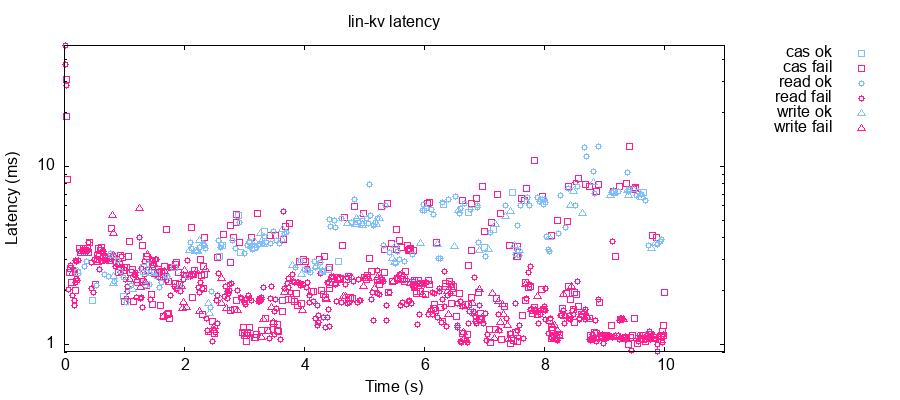
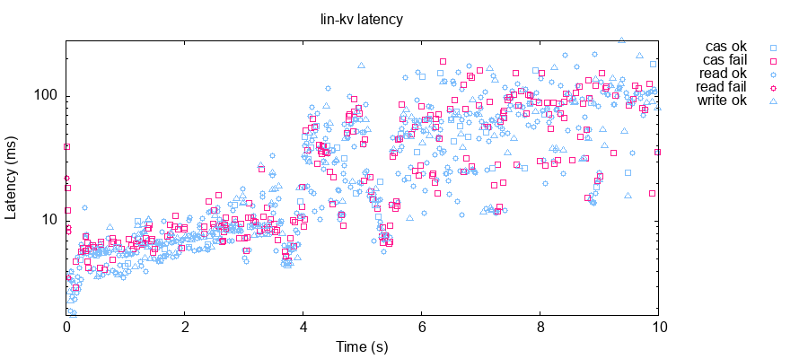
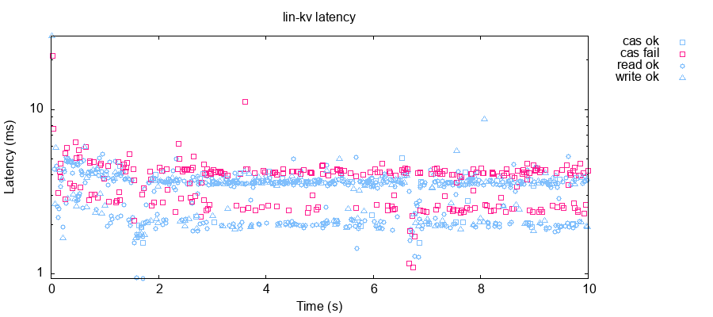
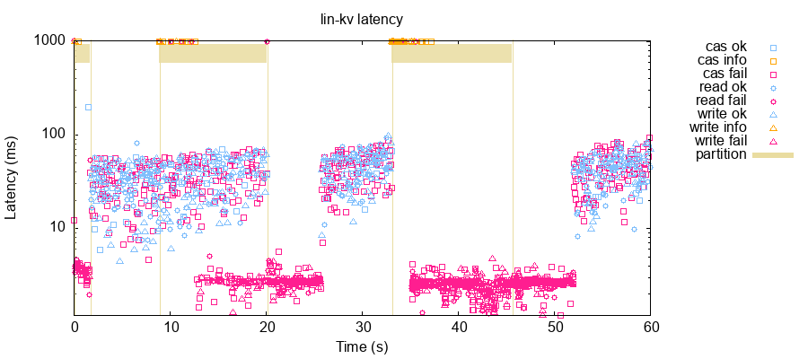

# Committing

If you test more aggressively, you should be able to observe nonlinearizable
behaviors in this system:

```clj
$ ./maelstrom test -w lin-kv --bin raft.rb --time-limit 60 --node-count 3 --concurrency 10n --rate 100 --nemesis partition --nemesis-interval 3 --test-count 5
...
Analysis invalid! (ﾉಥ益ಥ）ﾉ ┻━┻
```

This is because our server still applies operations locally and returns results
immediately--all our fancy log replication isn't actually being used to drive
the state machine. The only reason things worked *most* of the time is because
our leader election timeouts ensured leaders typically stepped down before new
ones could come to power.

In this section, we'll close the loop, and let Raft run the state machine. But
before we do that, we're going to make a brief performance optimization that
will make our changes much easier to demonstrate.

## Proxying to Leaders

If you look at `latency-raw.svg`, or have a glance at Maelstrom's logs during a test, you'll notice that almost all of our requests fail:

```clj
$ ./maelstrom test -w lin-kv --bin raft.rb --time-limit 10 --node-count 3 --concurrency 2n --rate 100
```



When we added the leader check in `kv_req`, we made it so *most* of the time,
only one node would actually execute client requests. When leaders change (e.g.
due to network partitions in longer tests), then we have a chance to observe
inconsistency between those two nodes. But fundamentally, the reason our tests
may have passed so far is because we simply weren't performing enough
operations, on enough different machines, to see anything interesting.

To change that, and just because most users expect requests to *any* node to
succeed, we're going to internally proxy requests to whatever node we think is
the current leader. We'll have RaftNode keep track of a `leader` variable...

```rb
class Raft
  ...
  def initialize
    ...
    # Raft state
    @state = 'follower'   # Either follower, candidate, or leader
    @term = 0             # What's our current term?
    @voted_for = nil      # Which node did we vote for in this term?
    @leader = nil         # Who do we think the leader is?
```

On any state transition, we'll reset the leader.

```rb
 def become_follower!
    @lock.synchronize do
      @state = :follower
      @match_index = nil
      @next_index = nil
      @leader = nil
      reset_election_deadline!
      @node.log "Became follower for term #{@term}"
    end
  end

  # Become a candidate, advance our term, and request votes.
  def become_candidate!
    @lock.synchronize do
      @state = :candidate
      advance_term!(@term + 1)
      @voted_for = @node.node_id
      @leader = nil
      reset_election_deadline!
      reset_step_down_deadline!
      @node.log "Became candidate for term #{@term}"
      request_votes!
    end
  end

  # Become a leader
  def become_leader!
    @lock.synchronize do
      unless @state == :candidate
        raise "Should be a candidate!"
      end

      @state = :leader
      @leader = nil
      @last_replication = Time.at 0

      # We'll start by trying to replicate our most recent entry
      @next_index = {}
      @match_index = {}
      @node.other_node_ids.each do |node|
        @next_index[node] = @log.size + 1
        @match_index[node] = 0
      end

      reset_step_down_deadline!
      @node.log "Became leader for term #{@term}"
    end
  end
```

And when we accept an `append_entries` request, we'll remember that node as the
current leader.

```rb
    @node.on 'append_entries' do |msg|
      body = msg[:body]
      @lock.synchronize do
        maybe_step_down! body[:term]

        res = {type: 'append_entries_res',
               term: @term,
               success: false}

        if body[:term] < @term
          # Leader is behind us
          @node.reply! msg, res
          break
        end

        # Leader is ahead of us; remember them and don't try to run our own
        # election for a bit.
        @leader = body[:leader_id] # New!
        reset_election_deadline!
```

Finally, we'll update `client_req!` with a new clause: if we're not the leader,
but we think we know who is, we'll proxy to them instead.

```rb
  # Handles a client RPC request
  def client_req!(msg)
    @lock.synchronize do
      if @state == :leader
        op = msg[:body]
        op[:client] = msg[:src]
        @log.append! [{term: @term, op: op}]
        @state_machine, res = @state_machine.apply(op)
        @node.reply! msg, res
      elsif @leader
        # We're not the leader, but we can proxy to one.
        @node.rpc! @leader, msg[:body] do |res|
          @node.reply! msg, res[:body]
        end
      else
        raise RPCError.temporarily_unavailable "not a leader"
      end
    end
  end
```

Now, almost all our requests can succeed!

```clj
$ ./maelstrom test -w lin-kv --bin raft.rb --time-limit 10 --node-count 3 --concurrency 2n --rate 100
```



## Improving Latency

The second optimization we're going to make is really simple. If you look at
`latency-raw.png`, you'll notice a steady increase in request latencies over
time. The plot is logarithmic, so this increase is actually linear--and there's
a simple cause. We pretty-print the *entire* log every time it changes, and
that's slow.

```rb
  # Appends multiple entries to the log.
  def append!(entries)
    entries.each do |e|
      # Coerce strings keys to keywords
      e = e.transform_keys(&:to_sym)
      e[:op] = e[:op].transform_keys(&:to_sym)
      @entries << e
    end
    # @node.log "Log: #{@entries.inspect}"
  end
```

With the log line commented out, operations go much faster. That'll
make it easier for us to test.



## Advancing the Commit Index

With our leaders elected, and log replicated, it's time to advance our commit
index. We can consider any entries that are committed on a majority of nodes
committed--that's the median of the matching indices, rounding down.

```rb
  # Given a collection of elements, finds the median, biasing towards lower
  # values if there's a tie.
  def median(xs)
    xs.sort[xs.size - majority(xs.size)]
  end
```

Now we'll add an action to advance the commit index, based on the matching
index: wherever an index is committed on a majority of servers, and that log
index is in the current term, we can advance our commit index.

```rb
  # If we're the leader, advance our commit index based on what other nodes
  # match us.
  def advance_commit_index!
    @lock.synchronize do
      if @state == :leader
        n = median(match_index.values)
        if @commit_index < n and @log[n][:term] == @term
          @node.log "Commit index now #{n}"
          @commit_index = n
        end
      end
    end
  end
```

We'll hook this into our `append_entries` response handler in `replicate_log!`,
since that's where the match index advances.

```rb
 def replicate_log!(force)
  ...
                  if @state == :leader and body[:term] == @term
                  reset_step_down_deadline!
                  if body[:success]
                    # Excellent, these entries are now replicated!
                    @next_index[node] = [@next_index[node],
                                         (ni + entries.size)].max
                    @match_index[node] = [@match_index[node],
                                          (ni + entries.size - 1)].max
                    @node.log "Next index: #{@next_index}"
                    advance_commit_index! # New!
```

And give it a shot! We'll run for 30 seconds and schedule a few network
partitions: with luck there'll be a leader election, and we can observe multiple
leaders incrementing their commit index.

```clj
$ ./maelstrom test -w lin-kv --bin raft.rb --time-limit 30 --node-count 3 --concurrency 2n --rate 1 --nemesis partition --nemesis-interval 10
...
$ grep -i 'commit index' store/latest/node-logs/n*.log
store/latest/node-logs/n0.log:Commit index now 12
store/latest/node-logs/n2.log:Commit index now 2
store/latest/node-logs/n2.log:Commit index now 4
store/latest/node-logs/n2.log:Commit index now 5
store/latest/node-logs/n2.log:Commit index now 6
store/latest/node-logs/n2.log:Commit index now 7
store/latest/node-logs/n2.log:Commit index now 8
store/latest/node-logs/n2.log:Commit index now 9
store/latest/node-logs/n2.log:Commit index now 10
store/latest/node-logs/n2.log:Commit index now 11
```

Here, n2 was the initial leader, and n0 took over after a network partition.
Looks good! Now that we know which entries are committed, we can apply those
entries to the state machine.

## Applying Entries

We're going to add a new method--if there are unapplied,
committed entries in the log, we catch up the state machine. First, we'll need
a `last_applied` index, which identifies the most recently applied entry:

```rb
class Raft
  def initialize
    ...
    # Leader state
    @commit_index = 0     # The highest committed entry in the log
    @last_applied = 1     # The last entry we applied to the state machine
    @next_index = nil     # A map of nodes to the next index to replicate
    @match_index = nil    # A map of (other) nodes to the highest log entry
                          # known to be replicated on that node.
```

Then we'll add a method which advances the state machine.

```rb
  # If we have unapplied committed entries in the log, apply them to the state
  # machine.
  def advance_state_machine!
    @lock.synchronize do
      while @last_applied < @commit_index
        # Advance the applied index and apply that op.
        @last_applied += 1
        req = @log[@last_applied][:op]
        @node.log "Applying req #{req}"
        @state_machine, res = @state_machine.apply req[:body]
        @node.log "State machine res is #{res}"

        if @state == :leader
          # We're currently the leader: let's respond to the client.
          @node.reply! req, res
        end
      end
    end
  end
```

Note that we're doing something a little odd here: the leader that sends the
reply might not be the same node that received the request. In a
connection-oriented protocol like TCP, we might have the original node that
received the request send the response instead. This raises the possibility
that *multiple* nodes might respond to a proxied client request, which might
mean a node gets a response after it's already deleted its callback. Let's make
a slight change to `Node#main!` to ignore `in_reply_to` messages which arrive when their callback is gone.

```rb
  # Loops, processing messages from STDIN
  def main!
    Thread.abort_on_exception = true

    while line = STDIN.gets
      msg = parse_msg line
      log "Received #{msg.inspect}"

      # What handler should we use for this message?
      handler = nil
      @lock.synchronize do
        # New!
        if in_reply_to = msg[:body][:in_reply_to]
          if handler = @callbacks[msg[:body][:in_reply_to]]
            @callbacks.delete msg[:body][:in_reply_to]
          else
            log "Ignoring reply to #{in_reply_to} with no callback"
          end
        elsif handler = @handlers[msg[:body][:type]]
        else
          raise "No handler for #{msg.inspect}"
        end
      end

      if handler # New!
        # Actually handle message
        Thread.new(handler, msg) do |handler, msg|
          begin
            handler.call msg
          rescue RPCError => e
            reply! msg, e.to_json
          rescue => e
            log "Exception handling #{msg}:\n#{e.full_message}"
            reply! msg, RPCError.crash(e.full_message).to_json
          end
        end
      end
    end
  end
```

Any time the commit index advances, we advance the state machine too. For leaders, that happens in `advance_commit_index!`...

```rb
  # If we're the leader, advance our commit index based on what other nodes
  # match us.
  def advance_commit_index!
    @lock.synchronize do
      if @state == :leader
        n = median(match_index.values)
        if @commit_index < n and @log[n][:term] == @term
          @node.log "Commit index now #{n}"
          @commit_index = n
        end
      end
      advance_state_machine! # New!
    end
  end
```

And for followers, they pick up new commit indices from the `append_entries`
handler:

```rb
  def initialize
    ...
    @node.on 'append_entries' do |msg|
      ...
        # Advance commit pointer
        if @commit_index < body[:leader_commit]
          @commit_index = [@log.size, body[:leader_commit]].min
          advance_state_machine! # New!
        end
```

Now that the state machine and responses are generated from the log, we can
drop the code that executes those operations locally in the request handler:

```rb
  # Handles a client RPC request
  def client_req!(msg)
    @lock.synchronize do
      if @state == :leader
        @log.append! [{term: @term, op: msg}]
      elsif @leader
        # We're not the leader, but we can proxy to one.
        @node.rpc! @leader, msg[:body] do |res|
          @node.reply! msg, res[:body]
        end
      else
        raise RPCError.temporarily_unavailable "not a leader"
      end
    end
  end
```

Let's give it a shot and see!

```clj
$ ./maelstrom test -w lin-kv --bin raft.rb --node-count 3 --concurrency 4n --rate 30 --time-limit 60 --nemesis partition --nemesis-interval 10 --test-count 10
Everything looks good! ヽ(‘ー`)/
```

While partitions are active, we may (or may not!) see temporary disruption to
some or all operations:



However, our final results are always linearizable! At least... *mostly*.
There's a bug lurking in this implementation: nodes may occasionally try to
roll back and append entries at 0. If you find an anomaly at this point, you've
probably caught a bug! See if you can use `linear.svg`, `timeline.html`,
`messages.svg`, and the node logs to piece together what happened, and how to
fix it.

Congratulations! You've written a linearizable key-value store from scratch. :-)

## Exercises

1. We replicate the *full* leader log on coming to power every time. Figure out
   how to safely cache the next and match indexes so we don't have to start
   from scratch each time.
2. Extend this server to allow nodes to execute reads against their local state
   instead of going through the leader and log. How does this change the
   linearizability results?
3. Write a new state machine which supports the transactional workload from
   `txn-list-append`, and show that it is (with reads going through the log)
   strict serializable. What happens if you turn the read-only optimization
   back on?
